# System Design Document (SDD)
## ShopSmart AI — Modern Full Stack E-commerce Platform

**Document Version:** 1.0
**Status:** Draft — Ready for Database Design & API Design Handoff
**Source Documents:** ShopSmart AI PRD v1.0 (Approved), ShopSmart AI SRS v1.0 (Approved)
**Last Updated:** July 26, 2026

**Technology Stack (Locked):** React + Vite + TypeScript (frontend) · Node.js + Express.js + TypeScript (backend) · PostgreSQL + Prisma ORM (database) · Redis (cache) · Cloudinary (media) · JWT + Refresh Tokens + HttpOnly Cookies (auth) · Stripe (payments, design-only) · Resend (email) · Docker + Nginx + GitHub Actions + AWS (deployment) · OpenTelemetry + Prometheus + Grafana (monitoring) · Winston/Pino (logging)

---

## 1. Executive Summary

This System Design Document defines the technical architecture for ShopSmart AI, translating the approved PRD and SRS into a concrete, engineering-ready design. The architecture is a **modular monolith** deployed as a set of stateless, horizontally scalable Node.js/Express services behind Nginx, backed by PostgreSQL (via Prisma) for transactional data and Redis for caching and ephemeral state. The design deliberately avoids premature microservices complexity while preserving clean module boundaries so the system can evolve into microservices, event-driven processing, or additional AI-driven services (recommendations, search, chat) without a rewrite.

This document is architecture-only: no database schemas, no API endpoint contracts, and no implementation code are included. It is intended to be sufficient for a senior engineering team to proceed directly into Database Design and API Design.

---

## 2. System Goals

- Serve a responsive, reliable storefront and admin console capable of scaling from thousands to millions of users without architectural rewrite
- Maintain strict transactional integrity for orders, payments, and inventory
- Provide sub-second perceived performance for browsing, search, and cart operations
- Enforce security best practices at every layer (transport, application, data)
- Keep the codebase modular enough to extract services (microservices) as scale demands
- Architect data and service boundaries so future AI capabilities (recommendations, semantic search, chatbot) can be added as additive services, not retrofits
- Support zero-downtime deployments and fast rollback

---

## 3. Architectural Drivers

| Driver | Design Response |
|---|---|
| **Scalability** | Stateless API layer, horizontal scaling behind a load balancer, Redis-backed caching, database read-replica readiness |
| **Security** | Defense-in-depth: HTTPS everywhere, JWT + rotating refresh tokens in HttpOnly cookies, RBAC, input validation, secrets management |
| **Availability** | Multi-instance API deployment, health checks, graceful degradation, circuit breakers on external dependencies |
| **Performance** | Redis caching for hot reads, CDN for static/media assets, pagination everywhere, background jobs for non-blocking work |
| **Reliability** | Idempotent payment/order operations, retries with backoff, transactional consistency via Prisma transactions |
| **Maintainability** | Modular monolith with clear module boundaries mirroring SRS Section 4 features; consistent error handling and logging conventions |
| **Extensibility** | Interface-first module boundaries (e.g., Search, Recommendation) that can be swapped for specialized services (Elasticsearch, AI microservice) without touching consumers |

---

## 4. High-Level Architecture

```
┌─────────────────────────────────────────────────────────────┐
│                        CLIENT LAYER                          │
│   React + Vite + TypeScript SPA (Storefront + Admin Console) │
└───────────────────────────┬───────────────────────────────────┘
                             │ HTTPS
┌───────────────────────────▼───────────────────────────────────┐
│                      API LAYER (Express)                      │
│  Routing · Request Validation · Auth Middleware · RBAC Guard  │
│  Rate Limiting · Error Translation · Response Shaping         │
└───────────────────────────┬───────────────────────────────────┘
                             │
┌───────────────────────────▼───────────────────────────────────┐
│                    BUSINESS LOGIC LAYER                       │
│  Module Services: Auth, User, Product, Cart, Checkout,        │
│  Order, Payment, Inventory, Coupon, Review, Notification,     │
│  Admin, Analytics, Search, File Upload                        │
└───────┬───────────────────────────────────────────┬───────────┘
        │                                           │
┌───────▼──────────────┐               ┌────────────▼────────────┐
│      DATA LAYER       │               │    EXTERNAL SERVICES    │
│  PostgreSQL (Prisma)  │               │  Stripe (payments)      │
│  Redis (cache/session)│               │  Cloudinary (media)     │
└───────────────────────┘               │  Resend (email)         │
                                         │  Courier/Shipping APIs  │
                                         └──────────────────────────┘
```

### Layer Responsibilities

**Client Layer** — Renders storefront and admin UI, manages local UI state, communicates exclusively via HTTPS with the API layer, holds no secrets beyond a short-lived access token in memory (refresh token lives in an HttpOnly cookie, never in JS-accessible storage).

**API Layer** — Single entry point for all client requests. Responsible for authentication verification, authorization (RBAC) enforcement, request validation, rate limiting, and translating internal errors into safe client-facing responses. Stateless — no session data held in process memory.

**Business Logic Layer** — Contains all domain modules (Section 6). Each module encapsulates its own business rules (per SRS Section 7 Business Rules) and communicates with other modules through well-defined internal service interfaces, not direct database access across module boundaries.

**Data Layer** — PostgreSQL is the system of record for all transactional data (users, products, orders, payments, inventory). Redis serves as a cache and ephemeral store (sessions, rate-limit counters, hot product data, cart data for guests).

**External Services** — Third-party integrations accessed through adapter interfaces (e.g., `PaymentGateway`, `EmailProvider`, `MediaStorageProvider`) so implementations (Stripe, Resend, Cloudinary) can be swapped without touching business logic.

---

## 5. Architecture Style

### Chosen Style: Modular Monolith (Layered, Domain-Oriented)

ShopSmart AI is built as a **modular monolith**: a single deployable Node.js/Express application internally organized into clearly bounded domain modules (Section 6), each with its own service layer, following lightweight Domain-Driven Design (DDD) principles — bounded contexts, domain services, and repository abstractions — without the operational overhead of distributed microservices at this stage.

| Style | Considered? | Verdict |
|---|---|---|
| **Layered Modular Monolith** | Yes | **Chosen.** Fast to build, easy to reason about transactions (single DB, single deploy unit), lower operational overhead, and sufficient for target scale (millions of users can be served by a well-cached, horizontally scaled monolith) |
| **Microservices** | Yes | Deferred. Introduces network overhead, distributed transaction complexity (e.g., saga patterns for order/payment/inventory), and operational cost (service mesh, multiple deploy pipelines) not justified at MVP-to-growth stage. Section 20 describes the extraction path. |
| **Event-Driven Architecture** | Yes | Deferred as primary style, but selectively adopted internally for non-critical-path work (email sending, analytics event capture) via an in-process/queue-backed job system, with a clear evolution path to a full message broker (Section 20) |
| **Domain-Driven Design (high-level)** | Yes | Adopted at the "tactical" level: modules = bounded contexts, each with its own service and repository layer, explicit domain events raised internally (e.g., `OrderConfirmed`, `PaymentCaptured`) even before a message broker exists — these events are consumed in-process today and can be republished to a broker later with minimal change |

**Trade-off summary:** The modular monolith trades some long-term independent-scalability (a microservice architecture could scale the Search module independently of Checkout) for dramatically lower complexity, faster time-to-market, and simpler transactional integrity — the right trade-off given current scale requirements (NFR-006: 1,000 concurrent users at MVP, scaling to 10,000+) and the explicit future evolution path documented in Section 20.

---

## 6. System Components

| Module | Responsibilities | Key Interactions |
|---|---|---|
| **Authentication Module** | Registration, login, OTP/email verification, password reset, JWT issuance, refresh token rotation, session/device management | User Module, Notification Module |
| **User Module** | Profile management, saved addresses, session listing | Authentication Module, Order Module (for address reuse) |
| **Product Module** | Product CRUD, variant management, publishing workflow | Category/Brand Module, Inventory Module, Search Module, File Upload Module |
| **Category Module** | Category hierarchy (up to 3 levels), navigation structure | Product Module |
| **Brand Module** | Brand CRUD and association | Product Module |
| **Inventory Module** | Stock tracking per SKU/variant, atomic decrement/restore, low-stock alerts | Product Module, Order Module, Notification Module |
| **Cart Module** | Cart CRUD (guest via Redis/local, registered via DB), coupon application, stock validation | Product Module, Inventory Module, Coupon Module |
| **Wishlist Module** | Save/remove/move-to-cart for registered users | Product Module, Cart Module |
| **Coupon Module** | Coupon validation, discount calculation, usage tracking | Cart Module, Checkout Module |
| **Checkout Module** | Orchestrates address, shipping, tax, coupon re-validation, and hands off to Payment/Order modules | Cart Module, Shipping Module, Payment Module, Order Module |
| **Order Module** | Order creation, status lifecycle, cancellation, history, invoice generation | Inventory Module, Payment Module, Notification Module |
| **Payment Module** | Payment intent creation, capture confirmation (Stripe), refund orchestration, idempotency enforcement | Order Module, Stripe (external) |
| **Shipping Module** | Zone/rate resolution, delivery estimation | Checkout Module, Courier API (external) |
| **Review Module** | Review submission (verified-purchase gated), moderation | Order Module, Product Module |
| **Notification Module** | Transactional email dispatch (via Resend), OTP delivery, admin alerts | Authentication Module, Order Module, Inventory Module |
| **Admin Module** | Admin dashboard aggregation, RBAC-scoped access to all management functions, audit log recording | All modules (read/write per permission) |
| **Analytics Module** | Sales/customer/inventory reporting, export | Order Module, Product Module, Inventory Module |
| **Search Module** | Keyword search, filters, autocomplete, fuzzy matching (initially Postgres full-text search; Elasticsearch-ready, see Section 20) | Product Module |
| **File Upload Module** | Image upload to Cloudinary, validation, optimization trigger | Product Module (product images), User Module (profile photo) |

---

## 7. Data Flow

### 7.1 User Registration
Client submits registration form → API Layer validates payload shape → Authentication Module hashes password, creates user record (PostgreSQL) → Notification Module dispatches verification email/OTP via Resend/SMS provider → client polls or redirects to a "verify your account" state.

### 7.2 Login
Client submits credentials → Authentication Module verifies password hash → on success, issues short-lived JWT access token (returned in response body/memory) and a long-lived refresh token (set as HttpOnly, Secure, SameSite cookie) → session metadata cached in Redis for fast revocation lookups.

### 7.3 Product Browsing
Client requests category/product listing → API Layer checks Redis cache for the requested key → on cache hit, returns cached payload; on miss, Product Module queries PostgreSQL via Prisma, result cached in Redis with a TTL, then returned.

### 7.4 Search
Client submits search query → Search Module executes a full-text query against PostgreSQL (indexed columns) with filter/sort parameters → results paginated and returned; autocomplete suggestions served from a Redis-cached "popular terms/prefixes" structure for low latency.

### 7.5 Add to Cart
Client sends add-to-cart request → Cart Module validates current stock via Inventory Module → cart entry persisted (Redis for guest session, PostgreSQL for registered user) → updated subtotal returned.

### 7.6 Checkout
Client initiates checkout → Checkout Module orchestrates: address resolution (User Module) → shipping cost (Shipping Module) → tax calculation (Settings) → coupon re-validation (Coupon Module) → final order summary returned for confirmation.

### 7.7 Payment
Client confirms payment → Payment Module creates a Stripe Payment Intent (or flags COD) with an idempotency key derived from the checkout session → on Stripe webhook confirmation, Payment Module marks payment as captured → triggers Order Module to finalize order creation.

### 7.8 Order Creation
Upon confirmed payment (or COD selection) → Order Module creates the order record within a database transaction that also instructs Inventory Module to atomically decrement stock → Notification Module sends order confirmation email → Analytics Module receives an internal `OrderCreated` domain event for reporting aggregation.

### 7.9 Inventory Update
Stock changes originate from: order confirmation (decrement), order cancellation/approved return (restore), or manual/bulk admin update → all paths go through the Inventory Module's single atomic update function, which enforces the non-negative-stock constraint via a database-level conditional update (row-level locking, see Section 13).

### 7.10 Order Tracking
Client requests order detail → Order Module returns current status and full status history; if a courier tracking reference exists, the Shipping Module fetches/caches the latest courier status (short Redis TTL to avoid hammering the courier API).

### 7.11 Returns & Refunds
Client submits return request → Order Module validates eligibility (delivered status, return window, category returnability) → creates a return record in "Requested" state → Support Agent (via Admin Module) approves/rejects → on approval and item receipt confirmation, Payment Module issues a refund through Stripe → Inventory Module restores stock → Notification Module confirms resolution to the customer.

---

## 8. Component Interaction

All client-to-server interaction follows a single synchronous request/response pattern over HTTPS, terminating at Nginx, which reverse-proxies to one of N stateless Express instances.

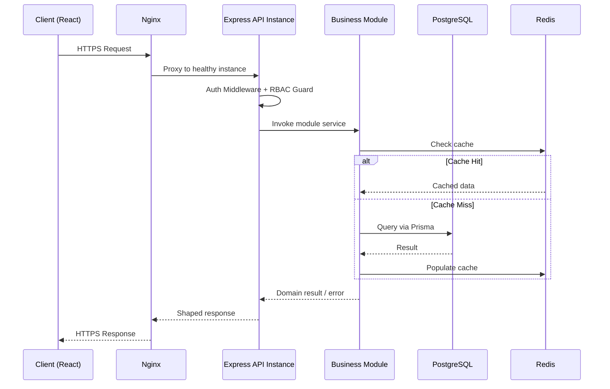

Inter-module communication within a single request occurs via **direct in-process service calls** (TypeScript interfaces), not network calls — this is the core benefit of the modular monolith. Cross-cutting, non-blocking work (emails, analytics event capture) is dispatched to an in-process job queue (with a documented upgrade path to a real message broker, Section 20) so it never blocks the primary request/response cycle.

---

## 9. Authentication & Authorization Design

### 9.1 JWT Flow
1. On successful login, the server issues a short-lived **access token** (JWT, ~15 minute expiry) containing minimal claims (user ID, role) — returned in the response body and held in client memory only (never localStorage, to reduce XSS token-theft risk)
2. A long-lived **refresh token** (opaque or JWT, ~7–30 day expiry) is issued alongside it and set as an **HttpOnly, Secure, SameSite=Strict cookie** — inaccessible to client-side JavaScript
3. The client attaches the access token as a Bearer header on API requests
4. When the access token expires, the client calls a silent `/auth/refresh` endpoint; the server validates the refresh token cookie, issues a new access token, and **rotates** the refresh token (old one invalidated, new one issued) to limit replay risk

### 9.2 Refresh Token Rotation & Revocation
Each refresh token is tracked server-side (a lightweight record in Redis or PostgreSQL keyed by token ID) so that:
- A used-and-rotated token is immediately invalidated (reuse detection — if an old, already-rotated token is presented again, the entire token family is revoked, signaling likely theft)
- Users can view and revoke active sessions (each session maps to a refresh token family)
- Password change invalidates all outstanding refresh tokens for that user

### 9.3 Cookie Strategy
- Refresh token cookie: `HttpOnly`, `Secure`, `SameSite=Strict`, scoped to the auth refresh endpoint path only
- No sensitive data ever placed in a client-readable cookie or localStorage

### 9.4 Role-Based Access Control (RBAC)
Three staff roles (Admin, Inventory Manager, Support Agent) plus two customer-facing states (Guest, Registered Customer). Each authenticated request passes through an **RBAC Guard** middleware that checks the JWT's role claim against the permission set required by the target route/module action. Permission checks are enforced **at the API layer**, never relying on the client UI to hide unauthorized actions (SEC-002).

### 9.5 Session Lifecycle

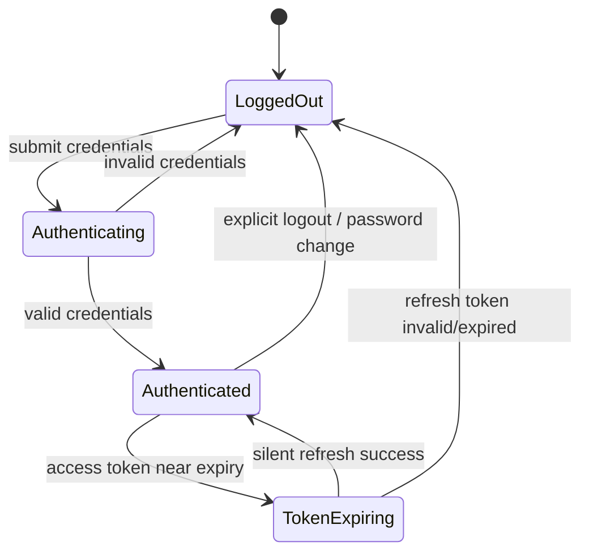

---

## 10. Security Architecture

| Control | Implementation Approach |
|---|---|
| **Password Hashing** | Adaptive hashing (bcrypt/argon2) with per-user salt; never reversible, never logged |
| **HTTPS** | Enforced end-to-end; HTTP requests redirected at Nginx; HSTS header set |
| **CSRF Protection** | SameSite=Strict cookies plus a CSRF token for state-changing requests as defense-in-depth |
| **XSS Prevention** | Output encoding on all user-generated content (reviews, profile fields); Content-Security-Policy header restricting inline scripts |
| **SQL Injection Protection** | Prisma's parameterized queries used exclusively; no raw string-concatenated queries |
| **Rate Limiting** | Redis-backed sliding-window rate limiter applied per IP/user, tightened specifically on `/auth/login`, `/auth/otp`, and `/checkout` endpoints |
| **File Upload Security** | Strict MIME-type and size validation before forwarding to Cloudinary; no direct execution path for uploaded files |
| **Secrets Management** | All credentials (DB, Stripe, Resend, Cloudinary) stored in a managed secrets store (e.g., AWS Secrets Manager) or environment-injected via CI/CD, never committed to source |
| **Secure Headers** | Helmet.js-equivalent header set: CSP, X-Frame-Options, X-Content-Type-Options, Referrer-Policy, HSTS |
| **Audit Logging** | Every sensitive admin action (refunds, role changes, price edits, order overrides) recorded with actor, timestamp, and before/after state, stored immutably |

---

## 11. Caching Strategy

| Cache Target | Strategy |
|---|---|
| **Product Cache** | Individual product detail and category listing pages cached in Redis with a moderate TTL (e.g., 5–10 minutes); invalidated immediately on product/price/stock update via a targeted cache-key delete |
| **Category Cache** | Category tree cached with a longer TTL (changes infrequently); invalidated on category CRUD |
| **Session Cache** | Refresh token family metadata and rate-limit counters stored in Redis with TTL matching token expiry |
| **Cart Cache (Guest)** | Guest cart stored in Redis keyed by an anonymous session ID, with a rolling TTL (e.g., 30 days) |
| **Search Autocomplete** | Popular search terms/prefixes cached in Redis (sorted set) for fast prefix lookups |

**Invalidation approach:** Write-through invalidation — any mutation to a cached entity triggers an explicit, targeted Redis key deletion (not a blanket flush), keeping cache hit rates high while guaranteeing freshness for the specific changed entity.

---

## 12. File Storage Design

- Product images and user profile photos are uploaded directly from the client (or via a signed upload flow) to **Cloudinary**, avoiding routing large binary payloads through the application server
- The API layer generates a **signed upload signature** (time-limited) so uploads are authenticated without exposing Cloudinary credentials to the client
- Cloudinary handles automatic image optimization (format conversion, responsive sizing via transformation URLs) and serves assets through its own CDN
- The application stores only the resulting Cloudinary URL/public ID in PostgreSQL, never the binary asset itself
- Upload validation (file type, size limit) is enforced both client-side (UX) and server-side (via the signed-upload constraints), satisfying SEC-009

---

## 13. Database Interaction Strategy

*(No table/schema design — strategy only, per scope constraints.)*

- **Repository Pattern:** Each domain module accesses PostgreSQL exclusively through a repository abstraction (a thin wrapper around Prisma Client calls specific to that module's entities). This keeps Prisma usage centralized and swappable, and prevents modules from reaching into each other's tables directly — cross-module data needs go through the owning module's service interface.
- **Prisma Usage:** Prisma Client is used as the sole ORM/query layer; Prisma Migrate manages schema evolution (schema design itself is a separate downstream phase). Prisma's type-safety is leveraged to catch data-shape errors at compile time.
- **Transactions:** Multi-step writes that must succeed or fail atomically (e.g., order creation + stock decrement, refund + stock restoration) are wrapped in Prisma's interactive `$transaction` API to guarantee ACID consistency.
- **Optimistic vs. Pessimistic Locking:** Inventory decrement operations use an **optimistic, conditional-update** pattern (`UPDATE ... WHERE stock >= quantity`) rather than heavy row locks, checking the affected row count to detect and reject over-decrement attempts — this scales better under concurrency than long-held pessimistic locks, while still preventing overselling (satisfies FR-080/NFR-009).
- **Connection Pooling:** A connection pool (via Prisma's built-in pooling, optionally fronted by PgBouncer at higher scale) is sized relative to expected concurrent request volume, preventing connection exhaustion under load spikes.

---

## 14. Error Handling Architecture

- **Global Error Handling:** A single Express error-handling middleware sits at the end of the middleware chain, catching all thrown/forwarded errors, logging them with full context, and translating them into a consistent, safe client-facing JSON error shape (`{ code, message }`), per SRS Section 9.
- **Custom Error Classes:** A small hierarchy of typed errors (`ValidationError`, `BusinessRuleError`, `AuthenticationError`, `AuthorizationError`, `NotFoundError`, `ExternalServiceError`) lets modules throw semantically meaningful errors that the global handler maps to the correct HTTP status and message shape without each module reinventing response formatting.
- **Validation Errors:** Enforced at the API boundary using a schema validation layer (e.g., request-shape validation before any business logic executes), returning field-level messages.
- **Business Errors:** Raised by domain modules (e.g., Coupon Module throwing `BusinessRuleError('COUPON_EXPIRED')`), mapped to specific, accurate client messages rather than generic failures.
- **Logging Strategy:** Every caught error is logged with a correlation/request ID, module name, and (for 5xx-class errors) full stack trace — never exposed to the client, only to internal logs/monitoring.

---

## 15. Logging & Monitoring

- **Structured Logging:** Winston/Pino configured for JSON-structured log output, including a request-correlation ID propagated through every log line for a given request, enabling trace reconstruction across modules.
- **Metrics:** Prometheus scrapes application metrics (request rate, error rate, latency histograms per route, cache hit/miss ratio, queue depth) exposed via a `/metrics` endpoint.
- **Tracing:** OpenTelemetry instrumentation traces requests across the API layer, business modules, database calls, and external service calls (Stripe, Cloudinary, Resend), giving end-to-end latency visibility per request.
- **Health Checks:** Each API instance exposes a lightweight `/health` (process liveness) and `/ready` (dependency readiness — DB/Redis reachable) endpoint consumed by the load balancer and orchestration layer.
- **Alerting:** Grafana dashboards visualize Prometheus metrics; alert rules fire on error-rate spikes, elevated P95 latency, low cache hit rate, and health-check failures, routed to the engineering on-call channel.

---

## 16. Performance Strategy

| Technique | Application |
|---|---|
| **Pagination** | All list endpoints (products, orders, reviews) are cursor- or offset-paginated; no unbounded result sets |
| **Lazy Loading** | Product images and below-the-fold storefront content lazy-loaded on the client |
| **Compression** | Gzip/Brotli response compression enabled at Nginx |
| **Query Optimization** | Indexes on frequently filtered/sorted columns (category, price, created date); N+1 query patterns avoided via Prisma's relation-loading features |
| **Caching** | Redis caching per Section 11 for hot-read paths (catalog, category) |
| **CDN** | Static frontend assets and Cloudinary-hosted images served via CDN edge locations |
| **Background Jobs** | Non-critical-path work (transactional emails, analytics aggregation, report generation) offloaded to a background job runner so it never blocks the customer-facing request |

---

## 17. Scalability Strategy

- **Horizontal Scaling:** The Express API layer is fully stateless (no in-memory session state); any number of instances can run behind Nginx/a load balancer, scaled up or down based on CPU/request-rate metrics.
- **Stateless APIs:** All session-relevant state (refresh token metadata, rate-limit counters, cart for guests) lives in Redis, not process memory, so any instance can serve any request.
- **Load Balancer:** Nginx (or a managed AWS load balancer at higher scale) distributes traffic across API instances with health-check-aware routing.
- **Database Scaling:** PostgreSQL scales vertically first (larger instance) as the simplest lever; **read replicas** are the designated next step for read-heavy paths (product browsing, search, analytics reporting) once single-primary throughput becomes a bottleneck.
- **Read Replicas (future):** Read-only queries (catalog browsing, analytics) routed to replicas; all writes and read-after-write-consistency-sensitive reads (cart, checkout, order status) remain on the primary.
- **Queue-Based Processing:** As background job volume grows, the in-process job runner is upgraded to a dedicated queue (Section 20) to decouple producer (API) load from consumer (worker) capacity.

---

## 18. Reliability & Fault Tolerance

- **Retry Strategies:** Transient failures calling external services (Stripe, Cloudinary, Resend, courier APIs) are retried with exponential backoff and a capped attempt count; retries are only applied to idempotent or safely-retryable operations.
- **Timeouts:** All outbound external calls have explicit timeouts to prevent a slow dependency from exhausting server resources or stalling user-facing requests.
- **Circuit Breakers:** A circuit breaker wraps calls to each external dependency; after a threshold of consecutive failures, the breaker opens and fails fast (with graceful degradation) rather than continuing to hammer a failing dependency.
- **Graceful Degradation:** If the courier tracking API is unavailable, the order tracking view falls back to the last known internal status rather than failing the entire page; if Redis is temporarily unavailable, the system degrades to direct database reads rather than hard-failing (with a monitored performance impact).
- **Idempotency:** Payment and order-creation operations require an idempotency key (derived from the checkout session) so that client retries, network blips, or duplicate webhook deliveries never produce duplicate charges or duplicate orders (satisfies FR-072/NFR-008).

---

## 19. Deployment Architecture

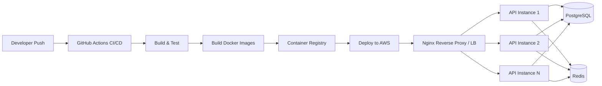

- **Docker Containers:** Each service (API, and eventually any extracted workers) is packaged as a Docker image with a multi-stage build (build stage compiles TypeScript, runtime stage ships only compiled output + production dependencies) for a small, secure image footprint.
- **Reverse Proxy (Nginx):** Terminates TLS, handles gzip/Brotli compression, routes to healthy API instances, and serves as the first line of rate-limiting/defense.
- **CI/CD (GitHub Actions):** On merge to main, pipeline runs lint → type-check → unit/integration tests → build Docker image → push to registry → deploy to the target environment, with automated rollback on failed health checks post-deploy.
- **Environment Separation:** Distinct configuration and infrastructure for Development, Staging, and Production, with production secrets never present in lower environments.
- **Secrets Management:** Managed secrets store (AWS Secrets Manager or equivalent) injects runtime secrets into containers; no secrets baked into images or committed to source control.

---

## 20. Future Evolution

| Direction | Evolution Path |
|---|---|
| **Microservices** | Extract high-independent-scale modules first (Search, Notification, Payment) into separate services once traffic patterns justify it; the existing module-boundary discipline (Section 6) makes extraction a matter of moving code + adding a network interface, not a redesign |
| **Event-Driven Architecture** | Domain events already raised in-process (`OrderConfirmed`, `PaymentCaptured`, `StockLow`) are republished to a message broker (Kafka/RabbitMQ) so multiple consumers (analytics, notifications, future AI services) can subscribe independently |
| **Multi-Warehouse** | Inventory Module extended with a warehouse/location dimension; order fulfillment logic gains a warehouse-selection step |
| **Multi-Tenant** | Data layer extended with tenant scoping (if the business model expands to hosting multiple storefronts); requires row-level tenant isolation strategy |
| **AI Recommendation Engine** | Consumes existing order/browsing-event data (already captured for analytics) as training input; served as an additive microservice behind the existing "recommendation placeholder" interface (FR-025) |
| **AI Chatbot** | Integrates as a new module consuming the Product and Order modules' existing service interfaces — no changes required to those modules |
| **Elasticsearch** | Search Module's interface is preserved; the Postgres full-text implementation is swapped for an Elasticsearch-backed implementation behind the same interface, with zero change to consumers |
| **Message Queue (RabbitMQ/Kafka)** | Background job runner (Section 17) upgraded to a durable queue, decoupling producers from consumer scaling and enabling the event-driven direction above |

---

## 21. Architecture Decision Records (ADRs)

### ADR-001: Modular Monolith over Microservices at Launch
**Decision:** Build as a modular monolith.
**Rationale:** Lower operational complexity, simpler transactional integrity for order/payment/inventory, faster initial delivery.
**Alternatives Considered:** Full microservices from day one — rejected due to premature complexity relative to current scale.

### ADR-002: PostgreSQL + Prisma over NoSQL
**Decision:** Use PostgreSQL as the system of record.
**Rationale:** E-commerce data (orders, payments, inventory) is inherently relational and requires strong transactional guarantees (ACID); Prisma provides type-safe access and straightforward migration tooling.
**Alternatives Considered:** MongoDB — rejected for this domain due to weaker native support for multi-entity transactional consistency at the required strictness.

### ADR-003: JWT + Rotating Refresh Tokens over Server-Side Sessions
**Decision:** Stateless JWT access tokens with rotating refresh tokens in HttpOnly cookies.
**Rationale:** Keeps the API layer stateless (supporting horizontal scaling) while retaining strong revocation capability via tracked refresh token families.
**Alternatives Considered:** Traditional server-side session store — rejected as it reintroduces server-side state that complicates horizontal scaling without added security benefit given the rotation strategy.

### ADR-004: Redis for Caching and Ephemeral State
**Decision:** Use Redis for caching, guest carts, rate limiting, and session metadata.
**Rationale:** Sub-millisecond access, native TTL support, widely proven at scale.
**Alternatives Considered:** In-memory application caching — rejected because it does not survive across multiple stateless instances.

### ADR-005: Cloudinary over Self-Managed Media Storage
**Decision:** Use Cloudinary for image storage and optimization.
**Rationale:** Built-in CDN, on-the-fly image transformation, and optimization eliminate significant custom engineering effort.
**Alternatives Considered:** Raw S3 + custom image processing pipeline — rejected as unnecessary engineering overhead at current stage; S3 remains a viable future migration if cost/control needs change.

### ADR-006: Stripe for Payments (Design-Only at This Phase)
**Decision:** Design payment integration against Stripe's model (Payment Intents, webhooks).
**Rationale:** Industry-standard, strong idempotency support, well-documented webhook model that maps cleanly to the order/payment state machine.

### ADR-007: In-Process Job Runner Before Message Broker
**Decision:** Start with an in-process/lightweight background job mechanism rather than introducing Kafka/RabbitMQ immediately.
**Rationale:** Avoids operational overhead of a distributed broker before the workload justifies it; the domain-event pattern (ADR-supporting Section 20) ensures a clean upgrade path later.

---

## 22. Risks & Trade-offs

| Risk | Trade-off / Mitigation |
|---|---|
| Modular monolith becomes a bottleneck at extreme scale | Mitigated by strict module boundaries today, enabling targeted microservice extraction later (Section 20) without a full rewrite |
| Redis becomes a single point of failure for cache/session data | Mitigated by graceful degradation to direct DB reads (Section 18) and, at higher scale, Redis clustering/replication |
| Single PostgreSQL primary becomes a write/read bottleneck | Mitigated by read-replica strategy (Section 17) and query optimization before considering sharding |
| Third-party dependency outages (Stripe, Cloudinary, Resend, courier) | Mitigated by circuit breakers, retries, and graceful degradation (Section 18) |
| Over-investing in future-proofing delays MVP delivery | Mitigated by deliberately deferring microservices/event-broker/Elasticsearch until real scale signals justify them (Section 20) |
| Refresh token theft via XSS | Mitigated by HttpOnly cookie storage, strict CSP, and refresh-token-family reuse detection (Section 9) |

---

## 23. Diagrams (Mermaid)

### 23.1 High-Level Architecture

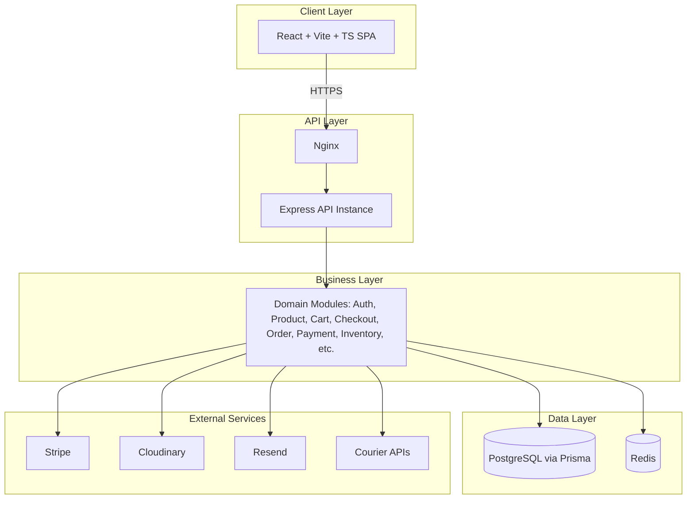

### 23.2 Layered Architecture

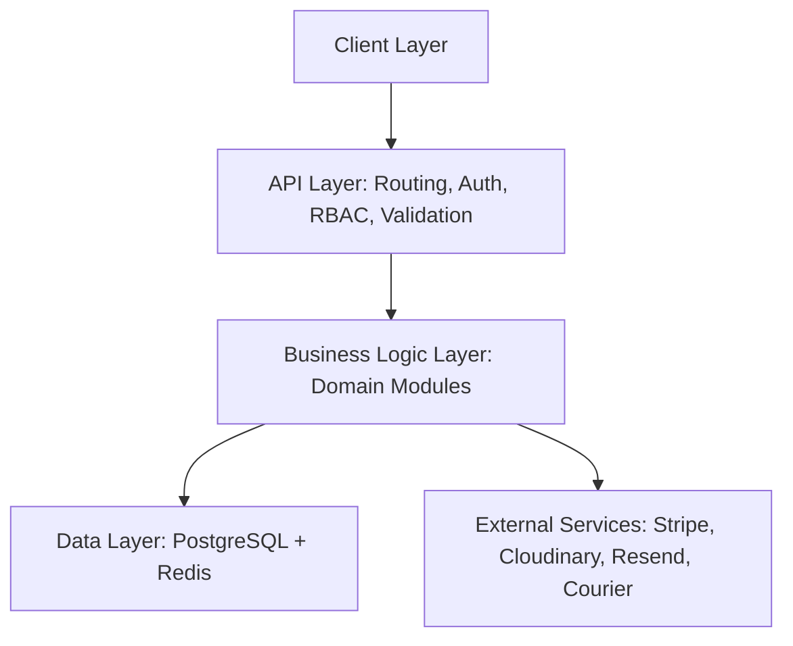

### 23.3 Component Diagram

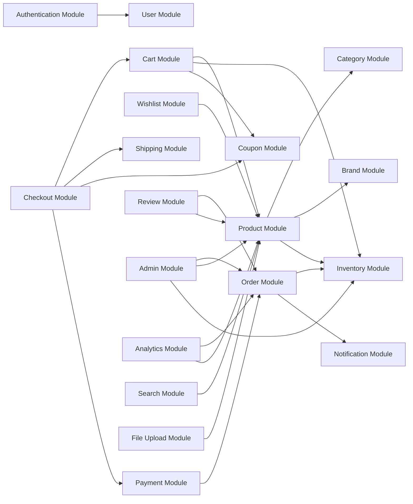

### 23.4 Authentication Flow

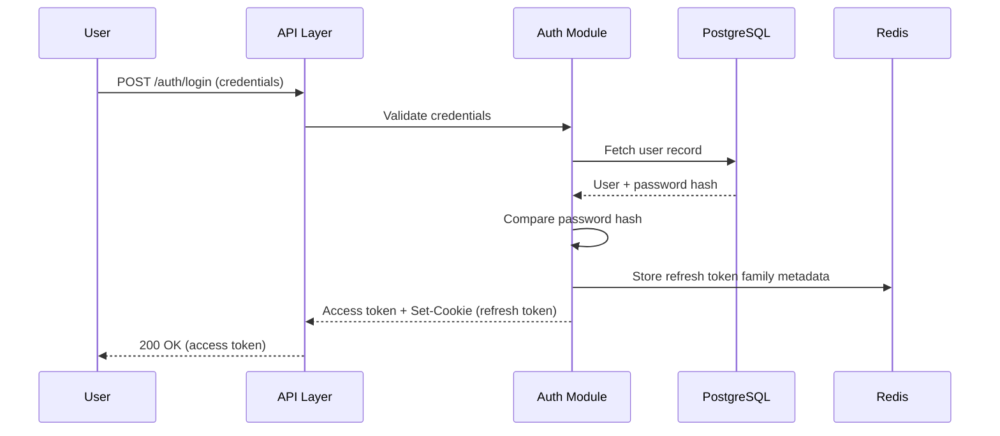

### 23.5 Checkout Flow

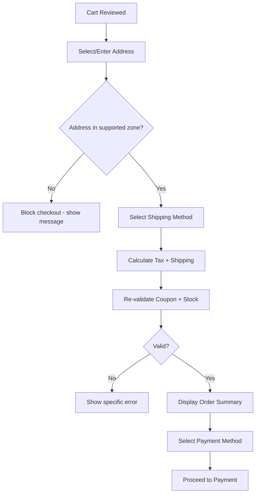

### 23.6 Order Processing Flow

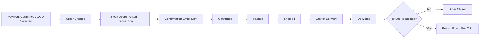

### 23.7 Deployment Diagram

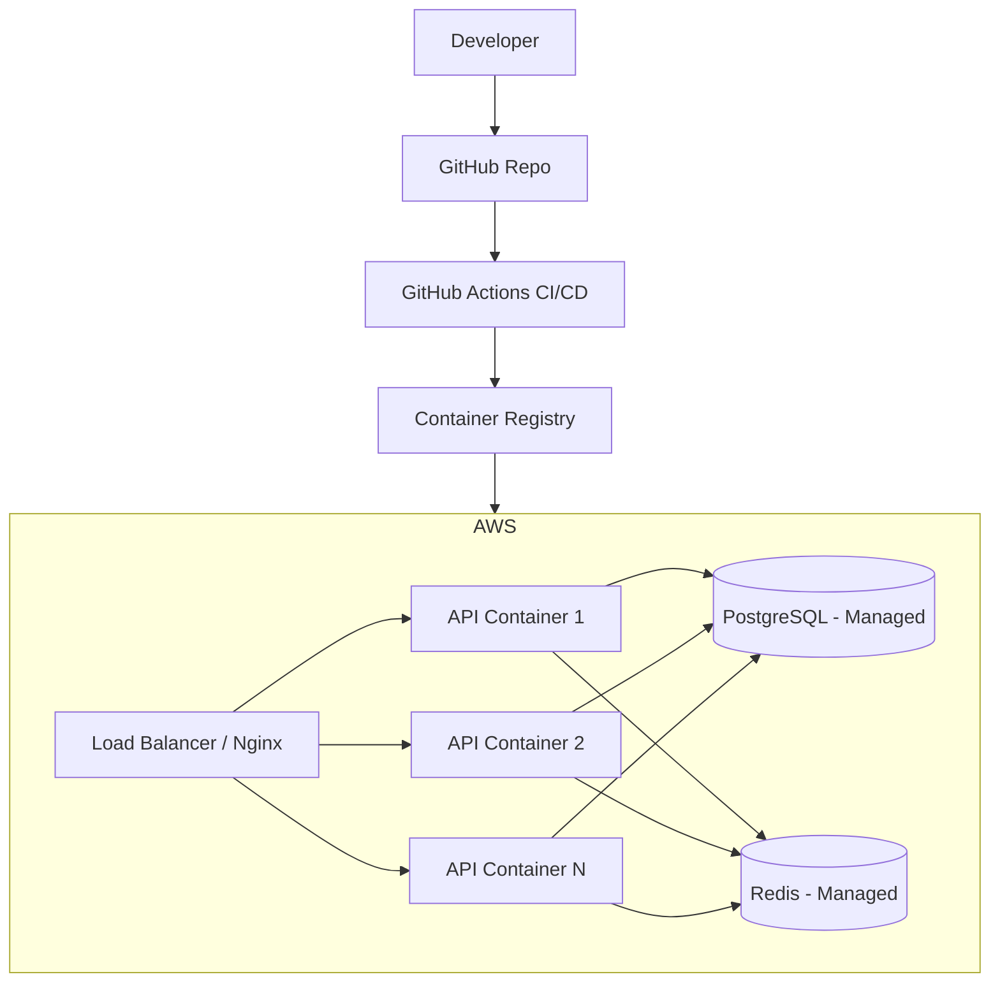

### 23.8 Sequence Diagram — Place Order

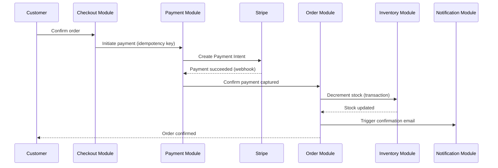

### 23.9 Sequence Diagram — Login

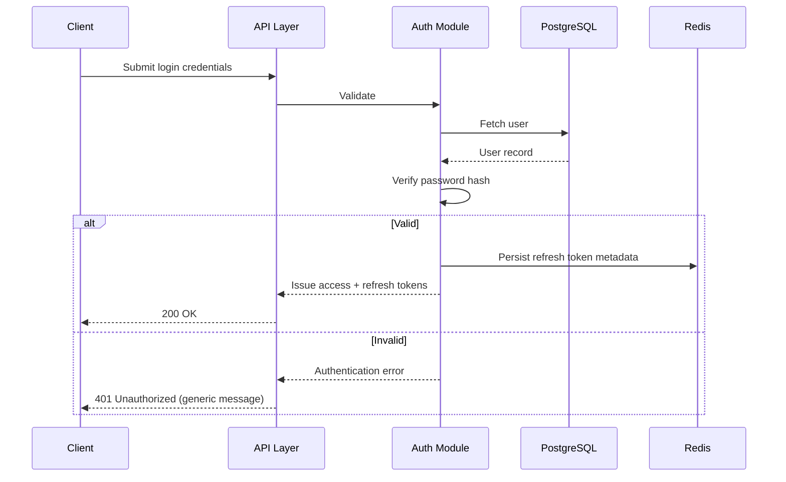

### 23.10 Data Flow Diagram

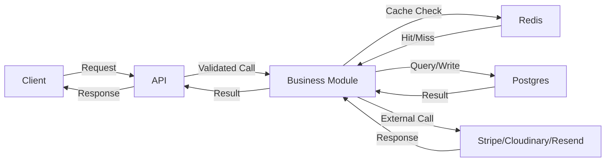

### 23.11 Request Lifecycle

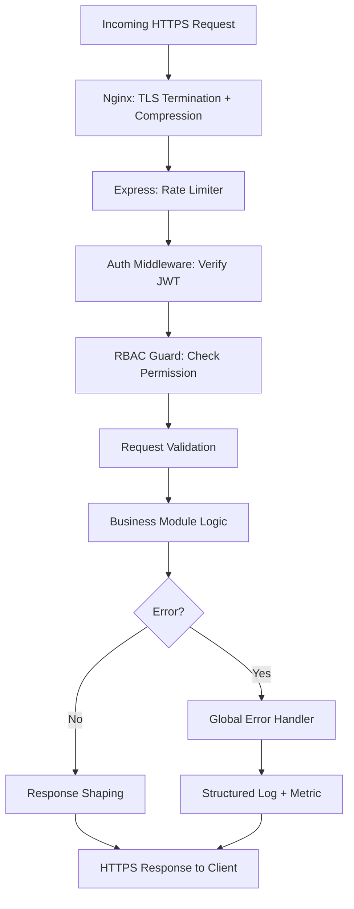

---

## 24. System Design Summary

ShopSmart AI is architected as a **modular monolith**: a single, horizontally scalable Node.js/Express/TypeScript deployment, internally organized into 18 clearly bounded domain modules that mirror the SRS's functional feature set. PostgreSQL via Prisma serves as the single, ACID-compliant system of record, with Redis providing caching, guest cart storage, and session/rate-limit state to keep the API layer fully stateless. Security is enforced through JWT access tokens paired with rotating, HttpOnly-cookie-stored refresh tokens, strict RBAC at the API layer, and defense-in-depth controls (CSRF, XSS, injection protection, rate limiting, secrets management).

Performance and scalability are achieved through targeted Redis caching, CDN-served static/media assets (via Cloudinary), pagination, and a stateless API layer ready for horizontal scaling behind Nginx. Reliability is guaranteed for the critical payment/order/inventory path through database transactions, optimistic-locking stock updates, and idempotent payment operations, backed by retries, timeouts, and circuit breakers for external dependencies.

Critically, the architecture is **not a dead end**: explicit module boundaries, an internal domain-event pattern, and interface-first design (Search, Payment, Notification) mean the system can evolve into microservices, adopt a message broker, integrate Elasticsearch, or add AI-driven services (recommendations, chatbot) as additive capabilities — without requiring a foundational rewrite. This design is considered complete and sufficient for the engineering team to proceed directly into Database Design and API Design.

---

*End of Document. This System Design Document is ready for handoff to the Database Design and API Design phases.*
