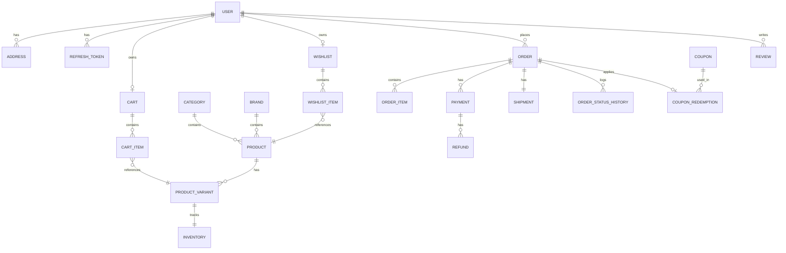
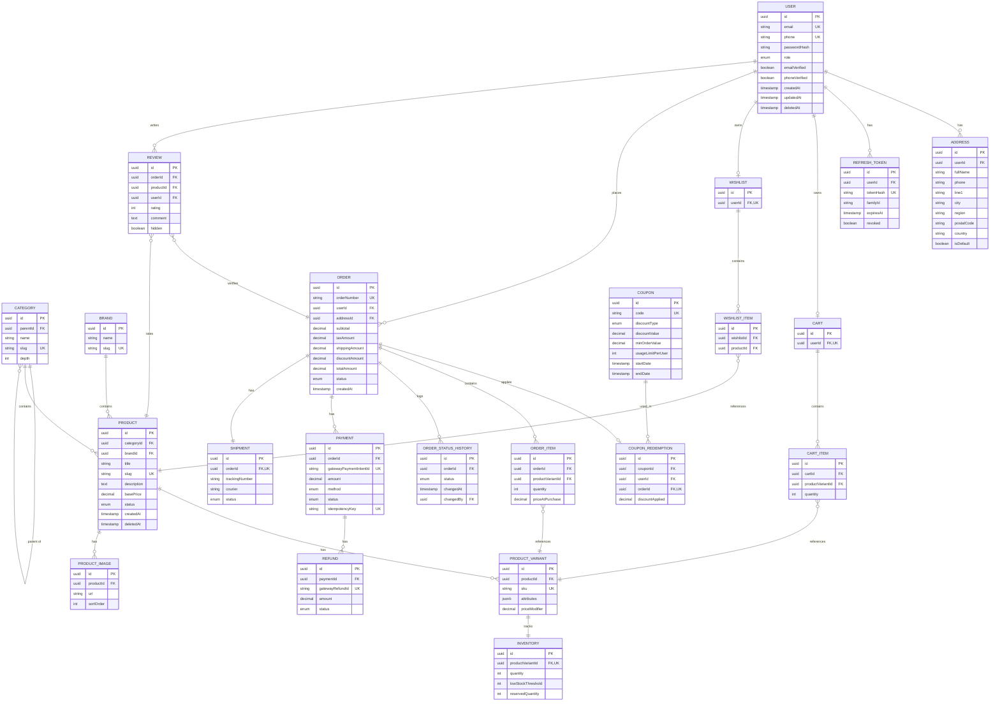

# Database Design Document (DDD)
## ShopSmart AI — Modern Full Stack E-commerce Platform

**Document Version:** 1.0
**Status:** Draft — Ready for Prisma Schema Implementation
**Source Documents:** PRD v1.0, SRS v1.0, System Design Document v1.0 (all Approved)
**Last Updated:** July 26, 2026

**Stack:** PostgreSQL · Prisma ORM · Redis (cache, not system of record) · Cloudinary (media, referenced by URL only) · Node.js/Express/TypeScript

---

## 1. Executive Summary

### 1.1 Database Goals
- Provide a normalized, relationally sound schema that guarantees transactional integrity for orders, payments, and inventory
- Support catalog scale of 10,000+ SKUs and future growth to millions of users without redesign
- Establish clean domain boundaries so each business module owns a well-defined set of tables (mirroring SDD Section 6 modules)
- Keep the schema AI-ready (Section 22) without introducing unused complexity today

### 1.2 Design Philosophy
The schema is designed **domain-first**: each bounded context (Section 2) owns its own entities, with cross-domain references expressed as foreign keys rather than duplicated data. Normalization to Third Normal Form (3NF) is the default; deliberate, documented denormalization is used only where read performance materially benefits (Section 8). Every table carries a consistent set of audit fields (Section 12), and soft deletion is used selectively where historical integrity matters (Section 13).

### 1.3 Assumptions
- Single-vendor (non-marketplace) catalog at this phase, per PRD Non-Goals
- Single currency, single language, single region at launch
- PostgreSQL is provisioned as a managed service (e.g., AWS RDS) with standard backup tooling available
- Prisma Migrate is the schema migration mechanism (migration files themselves are out of scope for this document)

### 1.4 Constraints
- No SQL or Prisma migration code is produced in this document — structure and rationale only
- No API or business logic design — that is defined in the SDD and downstream API Design phase
- Schema must remain single-tenant at launch, with a documented (not implemented) path to multi-tenancy (Section 19)

---

## 2. Domain Model

Each domain below is a bounded context owning a cluster of entities. The **Aggregate Root** is the entity through which all writes to that cluster are coordinated (enforcing invariants); other entities in the same domain are only ever modified through it.

### 2.1 Identity & Access
- **Purpose:** Authentication and session/token lifecycle
- **Aggregate Root:** `User`
- **Entities:** `User`, `RefreshToken`
- **Value Objects:** Email, PasswordHash
- **Relationships:** One `User` has many `RefreshToken` records (one per active session/device)
- **Business Rules:** BR-014 (guest data not persisted here); a user's password change invalidates all `RefreshToken` rows (SEC-011)

### 2.2 User Management
- **Purpose:** Profile and address data for registered customers
- **Aggregate Root:** `User` (shared root with Identity & Access — same physical entity, distinct responsibility)
- **Entities:** `Address`
- **Relationships:** One `User` has many `Address` records
- **Business Rules:** VR-005/006 (address must resolve to a supported shipping zone)

### 2.3 Product Catalog
- **Purpose:** Sellable product definitions and their purchasable variants
- **Aggregate Root:** `Product`
- **Entities:** `Product`, `ProductVariant`, `ProductImage`
- **Value Objects:** Price (decimal + currency, single currency at MVP), VariantAttribute (e.g., "Size: Large")
- **Relationships:** One `Product` has many `ProductVariant`; one `Product` has many `ProductImage`
- **Business Rules:** BR-001 (stock non-negative, enforced via Inventory domain); VR-007–010

### 2.4 Categories
- **Purpose:** Hierarchical product taxonomy
- **Aggregate Root:** `Category`
- **Entities:** `Category` (self-referencing up to 3 levels)
- **Relationships:** Many `Product` to one `Category`; `Category` self-referential parent/child

### 2.5 Brands
- **Purpose:** Brand taxonomy for products
- **Aggregate Root:** `Brand`
- **Entities:** `Brand`
- **Relationships:** Many `Product` to one `Brand` (optional)

### 2.6 Inventory
- **Purpose:** Authoritative stock tracking, decoupled from product metadata for concurrency isolation
- **Aggregate Root:** `Inventory`
- **Entities:** `Inventory` (one row per `ProductVariant`)
- **Business Rules:** BR-001, BR-008; concurrency strategy in Section 14
- **Rationale for separation:** see DDR-007

### 2.7 Shopping Cart
- **Purpose:** Pre-purchase item selection for registered users (guest carts live in Redis per SDD, not PostgreSQL)
- **Aggregate Root:** `Cart`
- **Entities:** `Cart`, `CartItem`
- **Relationships:** One `Cart` per registered `User` (1:1 active cart); one `Cart` has many `CartItem`

### 2.8 Wishlist
- **Purpose:** Saved-for-later products for registered users
- **Aggregate Root:** `Wishlist`
- **Entities:** `Wishlist`, `WishlistItem`
- **Relationships:** One `User` has one `Wishlist`; one `Wishlist` has many `WishlistItem`

### 2.9 Coupons
- **Purpose:** Discount code definition, restriction, and usage tracking
- **Aggregate Root:** `Coupon`
- **Entities:** `Coupon`, `CouponRedemption`
- **Relationships:** One `Coupon` has many `CouponRedemption` (one per usage, enforcing BR-003/BR-013)

### 2.10 Checkout
- **Purpose:** Ephemeral, in-progress purchase orchestration state
- **Aggregate Root:** `CheckoutSession`
- **Entities:** `CheckoutSession` (short-lived; graduates into an `Order` on success, or expires)
- **Rationale:** Kept as a lightweight table (not Redis-only) so a checkout-in-progress survives a Redis restart and supports idempotency key tracking (FR-072)

### 2.11 Orders
- **Purpose:** The confirmed, immutable-once-created record of a purchase and its lifecycle
- **Aggregate Root:** `Order`
- **Entities:** `Order`, `OrderItem`, `OrderStatusHistory`
- **Value Objects:** Money snapshot fields (subtotal, tax, shipping, discount, total — all captured at order time, never recalculated from live prices)
- **Business Rules:** BR-002, BR-005, BR-009, BR-010, BR-012

### 2.12 Payments
- **Purpose:** Payment capture and refund tracking, linked 1:1 (per attempt) to orders
- **Aggregate Root:** `Payment`
- **Entities:** `Payment`, `Refund`
- **Relationships:** One `Order` has one or more `Payment` records (supports retry-after-failure); one `Payment` has zero or more `Refund` records

### 2.13 Shipping
- **Purpose:** Zone/rate configuration and per-order shipment tracking
- **Aggregate Root:** `ShippingZone`
- **Entities:** `ShippingZone`, `ShippingRate`, `Shipment`
- **Relationships:** One `Order` has one `Shipment`; `ShippingZone` has many `ShippingRate`

### 2.14 Reviews
- **Purpose:** Verified-purchase product feedback
- **Aggregate Root:** `Review`
- **Entities:** `Review`
- **Business Rules:** BR-006 (only for delivered orders containing the product)

### 2.15 Notifications
- **Purpose:** Auditable record of dispatched notifications
- **Aggregate Root:** `NotificationLog`
- **Entities:** `NotificationLog`

### 2.16 Analytics
- **Purpose:** Derived/aggregated reporting data and abandoned-cart tracking
- **Aggregate Root:** `AbandonedCartSnapshot` (analytics is otherwise computed from Orders/Products at query time, not duplicated)
- **Entities:** `AbandonedCartSnapshot`

### 2.17 CMS
- **Purpose:** Static content management
- **Aggregate Root:** `CmsPage` (and independently, `Banner`, `FaqEntry`)
- **Entities:** `CmsPage`, `Banner`, `FaqEntry`

### 2.18 Audit Logs
- **Purpose:** Immutable record of sensitive administrative actions
- **Aggregate Root:** `AuditLog`
- **Entities:** `AuditLog`

### 2.19 Settings
- **Purpose:** Platform-wide configuration
- **Aggregate Root:** `PlatformSetting`
- **Entities:** `PlatformSetting`, `TaxRule`

---

## 3. Entity List

| Entity | Description | Primary Key | Candidate Keys | Foreign Keys | Ownership | Lifecycle |
|---|---|---|---|---|---|---|
| `User` | Registered account (customer or staff) | `id` (UUID) | `email`, `phone` | — | Identity & Access | Soft-deleted |
| `RefreshToken` | Tracked refresh-token family for session revocation | `id` (UUID) | `tokenHash` | `userId` → User | Identity & Access | Hard-deleted on expiry/revocation |
| `Address` | Saved shipping/billing address | `id` (UUID) | — | `userId` → User | User Management | Soft-deleted |
| `Product` | Sellable product definition | `id` (UUID) | `slug` | `categoryId` → Category, `brandId` → Brand | Product Catalog | Soft-deleted (archived) |
| `ProductVariant` | Purchasable variant (size/color/etc.) | `id` (UUID) | `sku` | `productId` → Product | Product Catalog | Soft-deleted |
| `ProductImage` | Image reference (Cloudinary URL) | `id` (UUID) | — | `productId` → Product | Product Catalog | Hard-deleted |
| `Category` | Taxonomy node (self-referencing) | `id` (UUID) | `slug` | `parentId` → Category (nullable) | Categories | Soft-deleted |
| `Brand` | Brand taxonomy | `id` (UUID) | `slug` | — | Brands | Soft-deleted |
| `Inventory` | Stock quantity per variant | `id` (UUID) | `productVariantId` (unique) | `productVariantId` → ProductVariant | Inventory | Hard-deleted only with variant |
| `Cart` | Active cart for a registered user | `id` (UUID) | `userId` (unique) | `userId` → User | Shopping Cart | Hard-deleted on order creation/reset |
| `CartItem` | Line item within a cart | `id` (UUID) | `(cartId, productVariantId)` | `cartId` → Cart, `productVariantId` → ProductVariant | Shopping Cart | Hard-deleted |
| `Wishlist` | Wishlist container per user | `id` (UUID) | `userId` (unique) | `userId` → User | Wishlist | Hard-deleted only with user |
| `WishlistItem` | Product saved to wishlist | `id` (UUID) | `(wishlistId, productId)` | `wishlistId` → Wishlist, `productId` → Product | Wishlist | Hard-deleted |
| `Coupon` | Discount code definition | `id` (UUID) | `code` | — | Coupons | Soft-deleted (deactivated) |
| `CouponRedemption` | Record of a coupon's use on an order | `id` (UUID) | `(couponId, orderId)` | `couponId` → Coupon, `userId` → User, `orderId` → Order | Coupons | Hard-deleted (never — retained for audit) |
| `CheckoutSession` | Ephemeral in-progress checkout state | `id` (UUID) | `idempotencyKey` | `userId` → User (nullable, guest), `cartId` → Cart (nullable) | Checkout | Hard-deleted after expiry/completion |
| `Order` | Confirmed purchase | `id` (UUID) | `orderNumber` (human-readable) | `userId` → User (nullable for guest), `addressId` → Address | Orders | Never deleted (append-only status) |
| `OrderItem` | Line item within an order (price snapshot) | `id` (UUID) | — | `orderId` → Order, `productVariantId` → ProductVariant | Orders | Never deleted |
| `OrderStatusHistory` | Append-only status transition log | `id` (UUID) | — | `orderId` → Order | Orders | Never deleted |
| `Payment` | Payment attempt/capture record | `id` (UUID) | `gatewayPaymentIntentId` | `orderId` → Order | Payments | Never deleted |
| `Refund` | Refund issued against a payment | `id` (UUID) | `gatewayRefundId` | `paymentId` → Payment | Payments | Never deleted |
| `ShippingZone` | Geographic shipping eligibility grouping | `id` (UUID) | `name` | — | Shipping | Soft-deleted |
| `ShippingRate` | Rate/method per zone | `id` (UUID) | `(zoneId, method)` | `zoneId` → ShippingZone | Shipping | Soft-deleted |
| `Shipment` | Courier tracking record for an order | `id` (UUID) | `trackingNumber` | `orderId` → Order (unique) | Shipping | Never deleted |
| `Review` | Product review by verified purchaser | `id` (UUID) | `(orderId, productId, userId)` | `orderId` → Order, `productId` → Product, `userId` → User | Reviews | Soft-deleted (moderation) |
| `NotificationLog` | Dispatched notification record | `id` (UUID) | — | `userId` → User (nullable) | Notifications | Hard-deleted (retention policy, e.g., 90 days) |
| `AbandonedCartSnapshot` | Point-in-time snapshot of an abandoned cart | `id` (UUID) | — | `userId` → User (nullable), `cartId` → Cart (nullable) | Analytics | Hard-deleted (retention policy) |
| `CmsPage` | Static content page | `id` (UUID) | `slug` | — | CMS | Soft-deleted |
| `Banner` | Homepage promotional banner | `id` (UUID) | — | — | CMS | Soft-deleted |
| `FaqEntry` | FAQ question/answer pair | `id` (UUID) | — | — | CMS | Soft-deleted |
| `AuditLog` | Immutable sensitive-action record | `id` (UUID) | — | `actorId` → User | Audit Logs | Never deleted |
| `PlatformSetting` | Key-value platform configuration | `id` (UUID) | `key` (unique) | — | Settings | Hard-deleted (rare) |
| `TaxRule` | Region-based tax rate | `id` (UUID) | `region` | — | Settings | Soft-deleted |

**Total: 31 entities**, cleanly mapped to the 19 domains in Section 2.

---

## 4. ERD (Entity Relationship Design)

### 4.1 High-Level ERD

### 4.2 Detailed ERD

**Cardinality notes:**
- **One-to-One:** `User`–`Cart`, `User`–`Wishlist`, `Order`–`Shipment`, `ProductVariant`–`Inventory`
- **One-to-Many:** `User`–`Address`, `Category`–`Product`, `Product`–`ProductVariant`, `Order`–`OrderItem`, `Order`–`Payment` (retry support), `Payment`–`Refund`
- **Many-to-Many (via junction):** `Cart`↔`ProductVariant` through `CartItem`; `Wishlist`↔`Product` through `WishlistItem`; `Order`↔`Coupon` through `CouponRedemption`
- **Self-Referencing:** `Category.parentId` → `Category.id`

---

## 5. Database Tables

*(Structural specification only — no SQL generated.)*

### Table: `User`
| Column | Type | Nullable | Default | Constraints |
|---|---|---|---|---|
| id | UUID | No | `gen_random_uuid()` | PK |
| email | VARCHAR(255) | Yes | — | UNIQUE (case-insensitive), CHECK format |
| phone | VARCHAR(20) | Yes | — | UNIQUE |
| passwordHash | TEXT | No | — | — |
| role | ENUM(`customer`,`admin`,`inventory_manager`,`support_agent`) | No | `customer` | — |
| emailVerified | BOOLEAN | No | `false` | — |
| phoneVerified | BOOLEAN | No | `false` | — |
| createdAt | TIMESTAMPTZ | No | `now()` | — |
| updatedAt | TIMESTAMPTZ | No | `now()` | auto-update |
| deletedAt | TIMESTAMPTZ | Yes | `null` | soft delete marker |

**Check constraint:** at least one of `email`/`phone` must be non-null.

### Table: `Address`
| Column | Type | Nullable | Default | Constraints |
|---|---|---|---|---|
| id | UUID | No | `gen_random_uuid()` | PK |
| userId | UUID | No | — | FK → User(id), ON DELETE CASCADE |
| fullName | VARCHAR(255) | No | — | — |
| phone | VARCHAR(20) | No | — | — |
| line1 | VARCHAR(255) | No | — | — |
| city | VARCHAR(100) | No | — | — |
| region | VARCHAR(100) | No | — | — |
| postalCode | VARCHAR(20) | Yes | — | — |
| country | VARCHAR(100) | No | — | — |
| isDefault | BOOLEAN | No | `false` | — |
| deletedAt | TIMESTAMPTZ | Yes | `null` | soft delete |

### Table: `Product`
| Column | Type | Nullable | Default | Constraints |
|---|---|---|---|---|
| id | UUID | No | `gen_random_uuid()` | PK |
| categoryId | UUID | No | — | FK → Category(id), ON DELETE RESTRICT |
| brandId | UUID | Yes | — | FK → Brand(id), ON DELETE SET NULL |
| title | VARCHAR(255) | No | — | — |
| slug | VARCHAR(255) | No | — | UNIQUE |
| description | TEXT | No | — | — |
| basePrice | NUMERIC(12,2) | No | — | CHECK (basePrice >= 0) |
| status | ENUM(`draft`,`pending_review`,`approved`,`rejected`) | No | `draft` | — |
| createdAt | TIMESTAMPTZ | No | `now()` | — |
| updatedAt | TIMESTAMPTZ | No | `now()` | auto-update |
| deletedAt | TIMESTAMPTZ | Yes | `null` | soft delete (archive) |

### Table: `ProductVariant`
| Column | Type | Nullable | Default | Constraints |
|---|---|---|---|---|
| id | UUID | No | `gen_random_uuid()` | PK |
| productId | UUID | No | — | FK → Product(id), ON DELETE CASCADE |
| sku | VARCHAR(64) | No | — | UNIQUE |
| attributes | JSONB | No | `{}` | e.g. `{"size":"L","color":"Red"}` |
| priceModifier | NUMERIC(12,2) | No | `0` | — |
| deletedAt | TIMESTAMPTZ | Yes | `null` | soft delete |

**Unique constraint:** `(productId, attributes)` to prevent duplicate variant combinations (VR-010).

### Table: `Inventory`
| Column | Type | Nullable | Default | Constraints |
|---|---|---|---|---|
| id | UUID | No | `gen_random_uuid()` | PK |
| productVariantId | UUID | No | — | FK → ProductVariant(id), ON DELETE CASCADE, UNIQUE |
| quantity | INTEGER | No | `0` | CHECK (quantity >= 0) |
| reservedQuantity | INTEGER | No | `0` | CHECK (reservedQuantity >= 0) |
| lowStockThreshold | INTEGER | No | `5` | — |
| version | INTEGER | No | `0` | optimistic locking counter |

### Table: `Cart` / `CartItem`
| Table | Column | Type | Nullable | Constraints |
|---|---|---|---|---|
| Cart | id | UUID | No | PK |
| Cart | userId | UUID | No | FK → User(id), UNIQUE, ON DELETE CASCADE |
| CartItem | id | UUID | No | PK |
| CartItem | cartId | UUID | No | FK → Cart(id), ON DELETE CASCADE |
| CartItem | productVariantId | UUID | No | FK → ProductVariant(id), ON DELETE RESTRICT |
| CartItem | quantity | INTEGER | No | CHECK (quantity > 0) |

**Unique constraint on CartItem:** `(cartId, productVariantId)` — quantity updates in place rather than duplicate rows.

### Table: `Order`
| Column | Type | Nullable | Default | Constraints |
|---|---|---|---|---|
| id | UUID | No | `gen_random_uuid()` | PK |
| orderNumber | VARCHAR(32) | No | — | UNIQUE, human-readable |
| userId | UUID | Yes | — | FK → User(id), ON DELETE SET NULL (guest orders retain data) |
| addressId | UUID | No | — | FK → Address(id), ON DELETE RESTRICT |
| subtotal | NUMERIC(12,2) | No | — | CHECK (subtotal >= 0) |
| taxAmount | NUMERIC(12,2) | No | — | CHECK (taxAmount >= 0) |
| shippingAmount | NUMERIC(12,2) | No | — | CHECK (shippingAmount >= 0) |
| discountAmount | NUMERIC(12,2) | No | `0` | CHECK (discountAmount >= 0) |
| totalAmount | NUMERIC(12,2) | No | — | CHECK (totalAmount >= 0) |
| status | ENUM(order lifecycle, per SRS Sec. 5) | No | `pending` | — |
| createdAt | TIMESTAMPTZ | No | `now()` | — |

**Note:** `Order` and `OrderItem` are never updated after creation except for the `status` column (and its append-only `OrderStatusHistory` trail); all money fields are immutable snapshots (BR pattern established in SRS Section 5.11).

### Table: `Payment`
| Column | Type | Nullable | Default | Constraints |
|---|---|---|---|---|
| id | UUID | No | `gen_random_uuid()` | PK |
| orderId | UUID | No | — | FK → Order(id), ON DELETE RESTRICT |
| gatewayPaymentIntentId | VARCHAR(255) | Yes | — | UNIQUE |
| amount | NUMERIC(12,2) | No | — | CHECK (amount >= 0) |
| method | ENUM(`card`,`cod`,`bank_transfer`) | No | — | — |
| status | ENUM(`pending`,`succeeded`,`failed`,`refunded`,`partially_refunded`) | No | `pending` | — |
| idempotencyKey | VARCHAR(255) | No | — | UNIQUE |

### Table: `Coupon`
| Column | Type | Nullable | Default | Constraints |
|---|---|---|---|---|
| id | UUID | No | `gen_random_uuid()` | PK |
| code | VARCHAR(64) | No | — | UNIQUE (case-insensitive) |
| discountType | ENUM(`percentage`,`flat`) | No | — | — |
| discountValue | NUMERIC(12,2) | No | — | CHECK (discountValue > 0), CHECK (percentage <= 100 when type=percentage) |
| minOrderValue | NUMERIC(12,2) | No | `0` | — |
| usageLimitPerUser | INTEGER | Yes | `null` | — |
| startDate | TIMESTAMPTZ | No | — | — |
| endDate | TIMESTAMPTZ | No | — | CHECK (endDate > startDate) |
| deletedAt | TIMESTAMPTZ | Yes | `null` | soft delete (deactivation) |

*(Remaining tables — `RefreshToken`, `Category`, `Brand`, `ProductImage`, `Wishlist`/`WishlistItem`, `CouponRedemption`, `CheckoutSession`, `OrderItem`, `OrderStatusHistory`, `Refund`, `ShippingZone`, `ShippingRate`, `Shipment`, `Review`, `NotificationLog`, `AbandonedCartSnapshot`, `CmsPage`, `Banner`, `FaqEntry`, `AuditLog`, `PlatformSetting`, `TaxRule` — follow the identical column/constraint documentation pattern shown above, scoped to their respective domain in Section 2 and entity definition in Section 3.)*

---

## 6. Relationships

| Relationship | Cardinality | Cascade Behavior |
|---|---|---|
| User → Address | 1:N | ON DELETE CASCADE (address is meaningless without the user) |
| User → Order | 1:N | ON DELETE SET NULL (order history must survive account deletion for financial/legal record-keeping) |
| Product → Category | N:1 | ON DELETE RESTRICT (cannot delete a category with existing products; must reassign first) |
| Product → Brand | N:1 | ON DELETE SET NULL (brand removal shouldn't delete products) |
| Product → ProductVariant | 1:N | ON DELETE CASCADE (a variant cannot exist without its parent product) |
| ProductVariant → Inventory | 1:1 | ON DELETE CASCADE |
| Cart → CartItem | 1:N | ON DELETE CASCADE |
| Order → OrderItem | 1:N | ON DELETE RESTRICT (orders are never deleted; this is a structural safeguard, not an expected path) |
| User → Wishlist | 1:1 | ON DELETE CASCADE |
| User → Review | 1:N | ON DELETE SET NULL (review content may be retained anonymized; business decision to confirm at implementation) |
| Order → Payment | 1:N | ON DELETE RESTRICT |
| Payment → Refund | 1:N | ON DELETE RESTRICT |
| Order → Shipment | 1:1 | ON DELETE RESTRICT |
| Coupon → CouponRedemption | 1:N | ON DELETE RESTRICT (redemption history is a financial/audit record and must outlive coupon deactivation) |

**General cascade philosophy:** CASCADE is used only where the child record is meaningless without the parent (e.g., cart items, addresses). RESTRICT is used wherever the child record has independent financial, legal, or audit significance (orders, payments, redemptions) — these paths should force an explicit business decision rather than an accidental cascade delete.

---

## 7. PostgreSQL Design

### 7.1 Why PostgreSQL
PostgreSQL was selected (ADR-002 in the SDD) because e-commerce data — orders, payments, inventory — is inherently relational and requires strong ACID transactional guarantees across multiple related writes (e.g., order creation + stock decrement must succeed or fail together). PostgreSQL additionally offers JSONB (for flexible variant attributes), native full-text search (sufficient for MVP-scale search per SRS FR-031–038), and mature replication/partitioning tooling for future scale.

### 7.2 UUID vs. Integer IDs
**Chosen: UUID (v4) primary keys.**
| Aspect | UUID | Integer/Serial |
|---|---|---|
| Merge/distributed-friendliness | Excellent — no collision risk across environments or future service extraction | Poor — requires coordination |
| Guessability/enumeration risk | Low (safe to expose in URLs) | High (sequential IDs leak business volume, e.g., order count) |
| Index size/performance | Slightly larger index footprint | Smaller, marginally faster |
| **Verdict** | **Chosen** — the security and future-microservice-extraction benefits outweigh the modest index-size cost, especially given Redis caching absorbs most hot-read pressure | Rejected for public-facing entities |

### 7.3 ENUM Usage
PostgreSQL native ENUM types are used for small, stable value sets with business meaning (`Order.status`, `Payment.method`, `User.role`, `Coupon.discountType`). This gives database-level validation (rejecting invalid values outright) rather than relying solely on application-layer checks.

### 7.4 JSONB Usage
JSONB is used narrowly and deliberately: `ProductVariant.attributes` (variable, product-type-dependent attribute sets like size/color/storage) is the primary JSONB column. This avoids an unwieldy sparse-column or full EAV (Entity-Attribute-Value) table design for variant attributes while retaining queryability via GIN indexing (Section 9).

### 7.5 Arrays
Native PostgreSQL arrays are avoided for core relational data (favoring junction tables for many-to-many, per Section 4) but may be used for simple, non-relational tags (e.g., a future `Product.searchTags TEXT[]` for lightweight keyword boosting) if introduced later.

### 7.6 Generated Columns
A generated column is recommended for `Product.searchVector` (a `tsvector` derived from `title` and `description`) to support full-text search (Section 7.7) without manual synchronization logic.

### 7.7 Full Text Search
PostgreSQL's built-in `tsvector`/`tsquery` full-text search, combined with a GIN index (Section 9), satisfies MVP search requirements (FR-031–033) including basic ranking. This is explicitly designed as a swappable implementation behind the Search Module's interface (SDD Section 20) — Elasticsearch can replace it later without touching consuming code.

### 7.8 Transactions, ACID, MVCC
PostgreSQL's Multi-Version Concurrency Control (MVCC) allows readers and writers to avoid blocking each other under the default `READ COMMITTED` isolation level, which is used for the vast majority of application queries. Critical multi-step writes (order creation + stock decrement + coupon redemption recording) are wrapped in explicit transactions (via Prisma's `$transaction`) to guarantee all-or-nothing execution (ACID atomicity/consistency).

### 7.9 Isolation Levels
- **Default:** `READ COMMITTED` for general application queries — sufficient for most reads and avoids unnecessary contention
- **`REPEATABLE READ` or `SERIALIZABLE`:** considered for the specific inventory-decrement transaction if optimistic-locking retries (Section 14) prove insufficient under extreme concurrency; not the default due to higher contention cost

### 7.10 Row-Level Locking
Row-level locking (`SELECT ... FOR UPDATE`) is available as a fallback for the inventory decrement path but the **primary strategy is optimistic, conditional-update locking** (Section 14) to avoid holding locks across the (potentially slower) payment-gateway round trip.

---

## 8. Normalization

- **1NF:** All tables have atomic column values; no repeating groups (variant attributes, while stored as JSONB for flexibility, are treated as a single logical "attribute set" value, not a violation of atomicity for this domain's purposes)
- **2NF:** All non-key attributes are fully dependent on the whole primary key; no partial dependencies (relevant since all tables use single-column UUID surrogate keys, 2NF violations are structurally avoided)
- **3NF:** No transitive dependencies — e.g., `Order` stores a `totalAmount` snapshot rather than deriving it from live product prices at read time, which is a **deliberate, documented denormalization** (below), not an accidental 3NF violation
- **BCNF:** Given single-column surrogate keys throughout, BCNF is satisfied wherever 3NF is satisfied for this schema

### Deliberate Denormalization
| Denormalized Field | Reason |
|---|---|
| `OrderItem.priceAtPurchase` | Order history must reflect the price paid, not the current (possibly changed) product price — this is a business requirement (SRS Section 5.9), not just a performance optimization |
| `Order.subtotal/taxAmount/shippingAmount/discountAmount/totalAmount` | Same rationale — immutable financial snapshot for audit/legal accuracy |
| `Coupon.discountValue` copied into `CouponRedemption.discountApplied` | Preserves the actual discount granted even if the coupon is later edited |

No other denormalization is introduced at this phase; additional denormalization (e.g., a cached `Product.averageRating`) is deferred until read-performance data justifies it (see Section 16).

---

## 9. Indexing Strategy

| Table.Column(s) | Index Type | Purpose |
|---|---|---|
| `User.email`, `User.phone` | B-tree (unique) | Fast login lookup (FR-005); enforced uniqueness |
| `RefreshToken.tokenHash` | B-tree (unique) | Fast token validation on every refresh call |
| `Product.slug` | B-tree (unique) | Fast product-detail-page lookup by friendly URL |
| `Product.categoryId`, `Product.brandId` | B-tree | Category/brand filter queries |
| `Product.searchVector` | GIN | Full-text search (Section 7.7) |
| `ProductVariant.attributes` | GIN | Enables querying/filtering by variant attribute (e.g., "find all Red variants") |
| `ProductVariant.sku` | B-tree (unique) | Inventory/order lookups by SKU |
| `Order.userId, Order.createdAt` | Composite B-tree | Order history queries (user's orders, newest first) |
| `Order.status` | B-tree | Admin order-management filtering (FR-086) |
| `Order.orderNumber` | B-tree (unique) | Customer-facing order lookup |
| `Coupon.code` | B-tree (unique) | Fast coupon validation lookup |
| `Coupon.startDate, Coupon.endDate` | Composite B-tree | Active-coupon range queries |
| `Inventory.productVariantId` | B-tree (unique) | 1:1 lookup during stock check/decrement |
| `Review.productId` | B-tree | Product-page review listing |
| `Review.(orderId, productId, userId)` | Composite unique | Enforces one review per order/product/user (BR-006, FR-101) |
| `CartItem.(cartId, productVariantId)` | Composite unique | Prevents duplicate line items; supports upsert-style quantity updates |

### Index Type Rationale
- **B-tree:** Default choice for equality/range lookups (the overwhelming majority of query patterns here)
- **GIN (Generalized Inverted Index):** Used specifically for `tsvector` full-text search and JSONB containment queries — the only two column types in this schema that benefit from GIN over B-tree
- **Composite Indexes:** Applied where queries consistently filter/sort on multiple columns together (e.g., `Order.userId + createdAt` for "my orders, newest first")
- **Partial Indexes:** Recommended for `Product` where `deletedAt IS NULL` (most queries only care about non-archived products) — a partial index keeps the index smaller and faster than indexing archived rows that are rarely queried

---

## 10. Prisma Design

*(Conceptual model description — no migration files generated.)*

### 10.1 Representative Model Definitions

**Model: `User`**
- Fields: `id`, `email`, `phone`, `passwordHash`, `role`, `emailVerified`, `phoneVerified`, `createdAt`, `updatedAt`, `deletedAt`
- Relations: `addresses` (one-to-many → `Address`), `refreshTokens` (one-to-many → `RefreshToken`), `cart` (one-to-one → `Cart`), `wishlist` (one-to-one → `Wishlist`), `orders` (one-to-many → `Order`), `reviews` (one-to-many → `Review`)
- Enum: `Role { customer admin inventory_manager support_agent }`
- Optional fields: `email`, `phone` (at least one required at the application-validation layer)
- Cascading: addresses/refreshTokens/cart/wishlist cascade delete with user; orders use `onDelete: SetNull`

**Model: `Product`**
- Fields: `id`, `title`, `slug`, `description`, `basePrice`, `status`, `createdAt`, `updatedAt`, `deletedAt`
- Relations: `category` (many-to-one → `Category`), `brand` (many-to-one → `Brand`, optional), `variants` (one-to-many → `ProductVariant`), `images` (one-to-many → `ProductImage`), `reviews` (one-to-many → `Review`)
- Enum: `ProductStatus { draft pending_review approved rejected }`
- Cascading: variants/images cascade delete with product

**Model: `ProductVariant`**
- Fields: `id`, `sku`, `attributes` (Json), `priceModifier`
- Relations: `product` (many-to-one → `Product`), `inventory` (one-to-one → `Inventory`), `cartItems` (one-to-many → `CartItem`), `orderItems` (one-to-many → `OrderItem`)
- Cascading: cascade delete with product; restrict delete if referenced by existing `OrderItem`

**Model: `Order`**
- Fields: `id`, `orderNumber`, `subtotal`, `taxAmount`, `shippingAmount`, `discountAmount`, `totalAmount`, `status`, `createdAt`
- Relations: `user` (many-to-one → `User`, optional/nullable for guest), `address` (many-to-one → `Address`), `items` (one-to-many → `OrderItem`), `payments` (one-to-many → `Payment`), `shipment` (one-to-one → `Shipment`), `statusHistory` (one-to-many → `OrderStatusHistory`), `couponRedemption` (one-to-one → `CouponRedemption`, optional)
- Enum: `OrderStatus { pending confirmed processing shipped out_for_delivery delivered payout... }` (aligned to SRS Section 5.9 lifecycle, adapted for single-vendor context: `pending confirmed processing shipped delivered cancelled disputed refunded`)

**Model: `Coupon`**
- Fields: `id`, `code`, `discountType`, `discountValue`, `minOrderValue`, `usageLimitPerUser`, `startDate`, `endDate`, `deletedAt`
- Relations: `redemptions` (one-to-many → `CouponRedemption`)
- Enum: `DiscountType { percentage flat }`

*(All remaining models — `Address`, `RefreshToken`, `Category`, `Brand`, `ProductImage`, `Inventory`, `Cart`, `CartItem`, `Wishlist`, `WishlistItem`, `CouponRedemption`, `CheckoutSession`, `OrderItem`, `OrderStatusHistory`, `Payment`, `Refund`, `ShippingZone`, `ShippingRate`, `Shipment`, `Review`, `NotificationLog`, `AbandonedCartSnapshot`, `CmsPage`, `Banner`, `FaqEntry`, `AuditLog`, `PlatformSetting`, `TaxRule` — follow the same documentation pattern: fields, relations with explicit relation names where Prisma requires disambiguation, applicable enums, and cascade behavior per Section 6.)*

### 10.2 Relation Naming Convention
Where a model has more than one relation to the same target model (e.g., `Order.userId` vs. a potential future `Order.assignedSupportAgentId`, both referencing `User`), Prisma's named relations (`@relation("OrderCustomer")` / `@relation("OrderSupportAgent")`) are used to disambiguate.

---

## 11. Naming Conventions

| Element | Convention | Example |
|---|---|---|
| Tables (Postgres, via Prisma `@@map`) | snake_case, plural | `product_variants` |
| Prisma Models | PascalCase, singular | `ProductVariant` |
| Columns (Postgres, via `@map`) | snake_case | `created_at` |
| Prisma Fields | camelCase | `createdAt` |
| Foreign Keys | `<referencedModel>Id` | `categoryId`, `userId` |
| Indexes | `idx_<table>_<column(s)>` | `idx_orders_user_id_created_at` |
| Unique Constraints | `uq_<table>_<column(s)>` | `uq_users_email` |
| Enums (Prisma) | PascalCase name, snake_case or lowercase values | `enum OrderStatus { pending confirmed ... }` |
| Junction Tables | `<ModelA><ModelB>` or purpose-named | `CartItem`, `WishlistItem`, `CouponRedemption` |

---

## 12. Audit Fields

| Field | Type | Applied To | Purpose |
|---|---|---|---|
| `id` | UUID | All tables | Primary key |
| `createdAt` | TIMESTAMPTZ | All tables | Record creation time |
| `updatedAt` | TIMESTAMPTZ | Mutable tables (User, Product, Cart, etc.) | Last modification time; NOT applied to immutable tables (`Order`, `OrderItem`, `Payment`, `AuditLog`) |
| `deletedAt` | TIMESTAMPTZ (nullable) | Soft-deleted tables only (Section 13) | Soft delete marker |
| `createdBy` | UUID (FK → User) | Admin-managed entities (Product, Category, Coupon, CmsPage) | Accountability for staff-created records |
| `updatedBy` | UUID (FK → User) | Same set as `createdBy` | Accountability for staff-modified records |

`createdBy`/`updatedBy` are intentionally **not** applied to customer-generated content (Cart, Wishlist, Review) where the owning `userId` already provides sufficient attribution.

---

## 13. Soft Delete Strategy

### 13.1 Why Soft Delete
Certain entities must remain queryable for historical, legal, or referential-integrity reasons even after a user-facing "delete" action — e.g., an archived product must still be visible on a historical order's detail page (SRS Section 4.3 acceptance criteria).

### 13.2 Tables Using Soft Delete
`User`, `Address`, `Product`, `ProductVariant`, `Category`, `Brand`, `Coupon`, `Review`, `CmsPage`, `Banner`, `FaqEntry`, `TaxRule`, `ShippingZone`, `ShippingRate`

### 13.3 Tables Using Hard Delete
`RefreshToken` (expired/revoked tokens have no retention value), `CartItem`/`Cart` (ephemeral pre-purchase data), `WishlistItem` (user-controlled removal is final), `NotificationLog`/`AbandonedCartSnapshot` (retention-policy-governed, purged after a fixed window), `CheckoutSession` (expires and is purged)

### 13.4 Tables That Are Never Deleted (Append-Only)
`Order`, `OrderItem`, `OrderStatusHistory`, `Payment`, `Refund`, `CouponRedemption`, `AuditLog`, `Shipment` — these are financial/audit records and are immutable by design, not subject to either soft or hard delete under normal operation.

### 13.5 Query Implications
Every Prisma repository method for soft-deletable models must apply a default `WHERE deletedAt IS NULL` filter (enforced via a Prisma middleware/extension at the repository layer, per SDD Section 13's Repository Pattern) so that archived records never leak into standard application queries; an explicit `includeDeleted` flag is required for admin/audit views that intentionally need to see archived data.

---

## 14. Concurrency Strategy

### 14.1 Optimistic Locking (Primary Strategy for Inventory)
The `Inventory.version` column implements optimistic locking: a stock-decrement operation reads the current `quantity` and `version`, then issues a conditional update (`WHERE id = ? AND version = ? AND quantity >= ?`), incrementing `version` on success. If the affected-row count is zero, the application retries (re-reading current state) or surfaces a stock-conflict error to the caller (FR-057, "Inventory Conflicts" in SRS Section 9).

### 14.2 Pessimistic Locking (Fallback, Not Default)
`SELECT ... FOR UPDATE` row-level locking remains available for the rare case of extremely high contention on a single hot SKU (e.g., a flash-sale item), but is not the default strategy because it holds a lock for the duration of the transaction, which is undesirable when a transaction might span a slower external call.

### 14.3 Inventory Reservation
To prevent overselling during the checkout window (between "add to cart" and "payment confirmed"), the `Inventory.reservedQuantity` column tracks stock temporarily held for in-progress checkouts (tied to a `CheckoutSession`). Available-to-sell quantity is computed as `quantity - reservedQuantity`. Reservations expire automatically if a `CheckoutSession` times out without completing payment, releasing the held stock.

### 14.4 Preventing Overselling
The combination of (a) the non-negative `CHECK` constraint on `Inventory.quantity`, (b) the optimistic-locking conditional update, and (c) the reservation mechanism above ensures that two concurrent checkouts for the last unit of a SKU cannot both succeed — exactly one wins the conditional update; the other is told the item is no longer available (satisfies NFR-009).

### 14.5 Transactions
All multi-table writes that must be atomic — order creation + stock decrement + reservation release, or return approval + stock restoration + refund creation — are wrapped in a single Prisma `$transaction` call, ensuring full rollback on any failure.

---

## 15. Data Integrity

- **Referential Integrity:** Enforced via PostgreSQL foreign key constraints on every relationship in Section 6, not left to application-layer discipline alone
- **Constraints:** `CHECK` constraints enforce business invariants directly in the database (non-negative stock/prices, valid discount ranges, coupon date ordering) as a last line of defense even if application validation is bypassed
- **Validation:** Primary validation occurs at the application layer (per SRS Section 8 Validation Rules) for good error messaging; database constraints are the backstop, not the primary UX
- **Cascade Rules:** See Section 6 — CASCADE only where children are meaningless without the parent
- **Restrict Rules:** Applied wherever premature deletion would compromise financial/audit history (orders, payments, redemptions, categories with active products)

---

## 16. Performance Strategy

- **Pagination:** All list-returning repository methods (`Product`, `Order`, `Review` listings) use cursor-based pagination (on `id` or `createdAt`) rather than large `OFFSET` values, which degrade on large tables
- **Query Optimization:** Prisma's `include`/`select` used deliberately to avoid over-fetching relations; N+1 patterns avoided via batched relation loading
- **Connection Pooling:** Prisma's connection pool sized relative to expected concurrent API instances × per-instance pool size; PgBouncer introduced as a shared pooling layer once instance count grows beyond what direct Postgres connections comfortably support
- **Read-Heavy Optimization:** Product/category browsing and search — the highest-volume read paths — are the primary beneficiaries of Redis caching (SDD Section 11) and, at scale, read replicas (Section 19)
- **Write-Heavy Optimization:** Order/payment/inventory writes are kept as small, focused transactions to minimize lock duration and contention; `OrderStatusHistory` is append-only (fast inserts, no updates)

---

## 17. Security

- **Encryption at Rest:** Enabled at the managed PostgreSQL provider level (e.g., AWS RDS storage encryption); no plaintext sensitive data written regardless
- **Sensitive Columns:** `User.passwordHash` (never plaintext, adaptive hash per SEC-001), `RefreshToken.tokenHash` (hashed, not the raw token), payment card data is **never stored** in this database at all — only gateway references (`Payment.gatewayPaymentIntentId`) are persisted, with the payment gateway holding the actual card data (PCI-DSS scope minimization)
- **Password Storage:** Adaptive hash (bcrypt/argon2) with per-record salt, per SEC-001
- **Token Storage:** Refresh tokens stored as a hash (not the raw token value) so a database compromise alone does not yield usable tokens
- **PII Handling:** `User` and `Address` tables contain the primary PII surface (name, email, phone, address); access to these tables is scoped via RBAC at the application layer and these tables are explicitly in-scope for any future data-protection compliance audit (NFR-020)

---

## 18. Backup & Recovery

- **Backup Strategy:** Automated daily full backups plus continuous WAL (Write-Ahead Log) archiving, enabling point-in-time recovery, consistent with NFR-015 (30-day minimum retention)
- **Point-in-Time Recovery (PITR):** WAL archiving allows restoration to any point within the retention window, critical for recovering from an accidental bad migration or data-corruption incident
- **Disaster Recovery:** Cross-region backup replication recommended once the platform moves beyond single-region launch; RPO of 24 hours and RTO of 4 hours (NFR-016) are achievable with standard managed-Postgres backup tooling at MVP scale

---

## 19. Scalability

| Growth Vector | Database Evolution Path |
|---|---|
| **Millions of Users** | Vertical scaling first (larger instance class), then read replicas for browse/search/analytics traffic |
| **Read Replicas** | Introduced once primary read load (catalog browsing, analytics queries) measurably contends with write throughput (checkout/order path); replicas serve read-only, eventually-consistent queries only |
| **Partitioning** | `Order` and `OrderStatusHistory` are natural candidates for time-based partitioning (e.g., by `createdAt` month/year) once row counts reach tens of millions, keeping indexes performant |
| **Multi-Warehouse** | `Inventory` extended with a `warehouseId` dimension; `quantity` becomes per-warehouse, with an aggregated view for storefront display |
| **Multi-Tenant** | Would require a `tenantId` column added across all tenant-scoped tables plus row-level security policies or schema-per-tenant isolation — a significant, deliberate future migration, not a current requirement |
| **Regional Databases** | If the business expands to multiple geographic markets with data-residency requirements, region-scoped database instances with a shared identity layer would be introduced |
| **Event Sourcing (Future)** | `OrderStatusHistory`'s append-only design is already a lightweight event-sourcing pattern for order state; a full event-sourcing migration (replacing `Order.status` as source of truth with a replayable event log) is a future option, not required at current scale |

---

## 20. Database Decision Records (DDRs)

### DDR-001: PostgreSQL over NoSQL
**Decision:** PostgreSQL as the sole system of record.
**Rationale:** Strong relational integrity and ACID transactions are required for orders/payments/inventory; PostgreSQL's JSONB support covers the schema's few flexible-data needs (variant attributes) without requiring a separate document store.
**Alternative Considered:** MongoDB — rejected due to weaker native multi-document transactional guarantees for this domain's core financial flows.

### DDR-002: Prisma over Raw SQL / Other ORMs
**Decision:** Prisma ORM.
**Rationale:** Strong TypeScript type generation aligned with the Node/Express/TypeScript stack (per SDD), clean migration tooling, and a query API expressive enough for this schema's relation complexity without needing raw SQL for common cases.
**Alternative Considered:** TypeORM — rejected due to comparatively less mature type-safety guarantees and migration ergonomics at the time of this decision.

### DDR-003: UUID over Auto-Increment Integer Keys
**Decision:** UUID primary keys throughout.
**Rationale:** See Section 7.2 — security (non-enumerable IDs) and future distributed/microservice-friendliness outweigh the minor index-size cost.
**Alternative Considered:** Integer/serial keys with a separate public-facing "slug" or "order number" — partially adopted anyway (`Product.slug`, `Order.orderNumber`) for human-readable references, while UUID remains the internal PK.

### DDR-004: Soft Deletes for Catalog/Content, Hard Deletes for Ephemeral Data
**Decision:** Selective soft deletion (Section 13), not a blanket policy.
**Rationale:** Blanket soft-deletion adds query complexity and index bloat everywhere; applying it only where historical/referential integrity genuinely requires it (products referenced by past orders, reviews subject to moderation reversal) keeps the schema simpler elsewhere.
**Alternative Considered:** Soft delete everywhere — rejected as unnecessary overhead for genuinely ephemeral data (cart items, checkout sessions).

### DDR-005: Junction Tables over Arrays for Many-to-Many
**Decision:** Explicit junction tables (`CartItem`, `WishlistItem`, `CouponRedemption`) rather than PostgreSQL array columns.
**Rationale:** Junction tables support proper foreign-key referential integrity, per-row metadata (e.g., `CartItem.quantity`), and standard relational querying/indexing; arrays would sacrifice all of this for a marginal storage simplification.

### DDR-006: Separate `Inventory` Table Rather Than a Stock Column on `ProductVariant`
**Decision:** `Inventory` is its own table (1:1 with `ProductVariant`), not a column on `ProductVariant` itself.
**Rationale:** Isolates the high-write-contention stock-update path from the comparatively low-write catalog-metadata path, reducing lock contention on `ProductVariant` rows during checkout spikes, and gives the optimistic-locking `version` column a clean, single-purpose home.
**Alternative Considered:** Stock as a column directly on `ProductVariant` — rejected due to unnecessary contention coupling between catalog edits and inventory decrements.

### DDR-007: Separate `OrderItem` Table Rather Than a JSON Items Array on `Order`
**Decision:** `OrderItem` as its own table.
**Rationale:** Enables proper relational querying (e.g., "top-selling products" analytics, FR-091), foreign-key integrity to `ProductVariant`, and per-item indexing — a JSON blob on `Order` would make these query patterns significantly harder and slower.
**Alternative Considered:** JSONB `items` column on `Order` — rejected for the analytics/query reasons above, despite the appeal of atomic single-row writes.

---

## 21. Risks

| Risk | Mitigation |
|---|---|
| **Hot Tables** — `Inventory` and `Order` under high checkout volume (e.g., flash sales) | Optimistic locking with retry/backoff (Section 14); short, focused transactions; reservation mechanism to reduce contention window |
| **Large Product Catalogs** — degraded browse/search performance beyond 10,000+ SKUs | Redis caching (SDD Section 11), GIN-indexed full-text search, partial indexes on non-archived products, eventual read-replica offload |
| **Inventory Contention** — many concurrent buyers competing for the same low-stock SKU | Reservation mechanism + optimistic locking (Section 14.3–14.4); monitored via low-stock alerting (FR-105) |
| **Deadlocks** — multi-table transactions acquiring locks in inconsistent order | Enforce a consistent lock-acquisition order convention across all multi-table transactions (e.g., always lock `Inventory` before `Order` within a given transaction) |
| **Long Transactions** — a transaction spanning a slow external call (e.g., waiting on a payment gateway) | Payment gateway calls are explicitly kept **outside** database transactions; only the fast, local order/stock writes are wrapped transactionally, triggered only after gateway confirmation is already received |

---

## 22. Future Enhancements

| Enhancement | Schema Readiness |
|---|---|
| **AI Recommendations** | Existing `Order`/`OrderItem`/browsing-event data (captured for Analytics) provides the raw training signal without additional schema changes; a future `RecommendationScore` cache table can be added additively |
| **Product Embeddings** | `Product` table can gain a `pgvector`-typed `embedding` column (PostgreSQL `pgvector` extension) without disrupting existing structure |
| **Semantic Search** | Layered on top of the same `pgvector` embedding column, or delegated to an external vector store, behind the Search Module's stable interface (SDD Section 20) |
| **Elasticsearch Integration** | The existing `tsvector`-based search can be replaced by an Elasticsearch-backed implementation with `Product`/`Category`/`Brand` data synced via change-data-capture or application-level dual-write, without changing the Search Module's consumer-facing contract |
| **Event Bus** | `OrderStatusHistory`'s append-only pattern is already event-shaped; a message broker can subscribe to these transitions with minimal schema change |
| **Marketplace Vendors** | Would require introducing a `Vendor` entity and a `vendorId` foreign key on `Product` (and correspondingly on `Order`/`OrderItem` splitting), a deliberate, larger future migration — not attempted at this phase per PRD Non-Goals |
| **Loyalty Program** | Additive `LoyaltyAccount`/`LoyaltyTransaction` tables referencing `User` and `Order`, no changes to existing tables required |
| **Gift Cards** | Additive `GiftCard`/`GiftCardRedemption` tables, structurally similar to the existing `Coupon`/`CouponRedemption` pattern |
| **Subscription Products** | Additive `Subscription`/`SubscriptionOrder` tables referencing `User` and `Product`, layered on top of the existing Order model rather than replacing it |

---

## 23. Final Database Summary

The ShopSmart AI database is a normalized PostgreSQL schema of 31 entities across 19 bounded domains, designed with Prisma ORM as the access layer. UUID primary keys, selective JSONB usage (variant attributes only), and native full-text search keep the design both relationally sound and pragmatically flexible. Financial and audit-critical entities (`Order`, `Payment`, `Refund`, `AuditLog`, `CouponRedemption`) are treated as append-only/immutable, while catalog and content entities use soft deletion to preserve historical referential integrity without cluttering the schema everywhere.

Concurrency safety for the highest-risk path — inventory during checkout — is handled through optimistic locking plus a reservation mechanism, avoiding both overselling and unnecessary lock contention. Indexing is targeted (B-tree for standard lookups, GIN for full-text/JSONB), and the schema's scalability path (read replicas, partitioning, multi-warehouse, multi-tenant) is documented without being prematurely implemented. Security follows PCI-DSS scope minimization (no card data stored) and standard PII/password-hash handling practices.

Critically, every future-facing capability named in the PRD roadmap — AI recommendations, semantic search, Elasticsearch, marketplace vendors, loyalty, gift cards, subscriptions — has a clear, additive schema evolution path (Section 22) that does not require restructuring the tables defined here. This design is considered complete and ready for direct Prisma schema implementation.

---

*End of Document. This Database Design Document is ready for handoff to Prisma schema implementation and API Design.*
