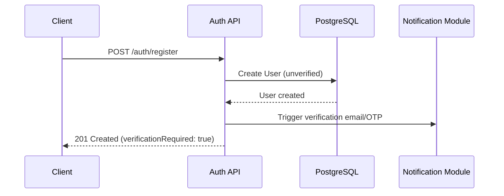
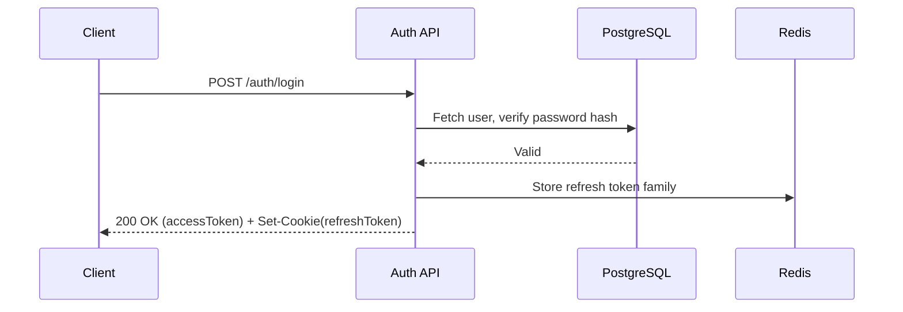
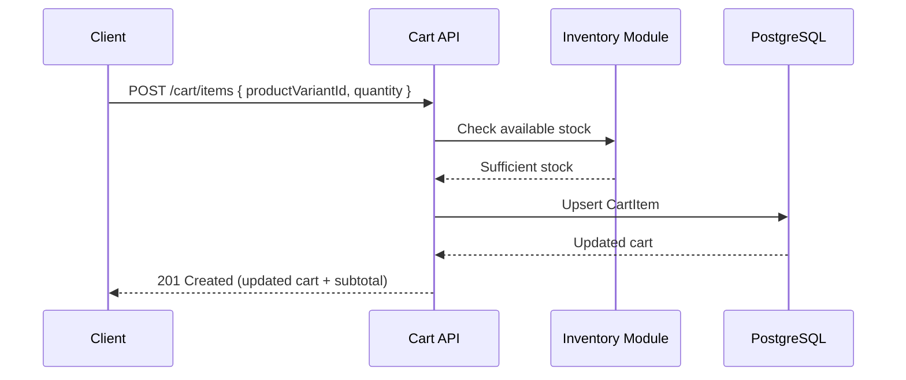
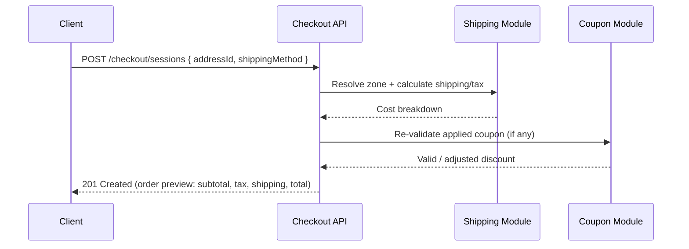
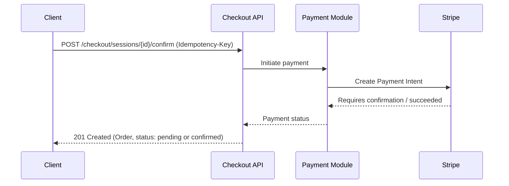
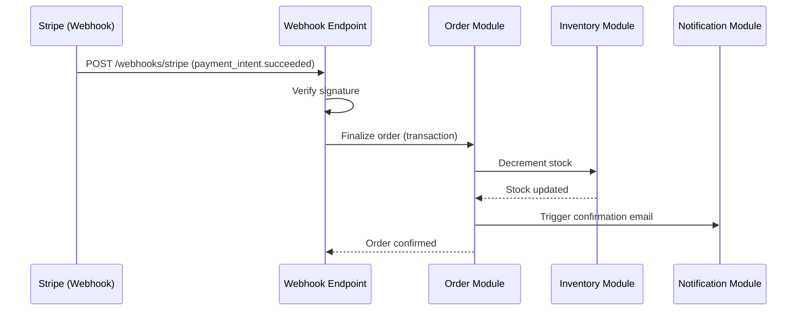
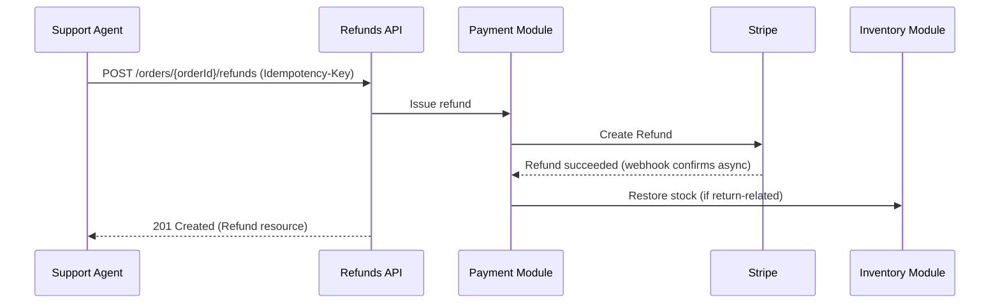

# API Design Specification
## ShopSmart AI — Modern Full Stack E-commerce Platform

**Document Version:** 1.0
**Status:** Draft — Ready for Independent Frontend/Backend Implementation
**Source Documents:** PRD, SRS, System Design Document, Database Design Document (all v1.0, Approved)
**Standard Followed:** OpenAPI 3.1, REST, RFC 7807 (Problem Details)
**Last Updated:** July 26, 2026

---

## 1. Executive Summary

### 1.1 API Goals
- Provide a single, versioned REST contract that frontend and backend teams can implement against independently
- Guarantee consistent request/response shapes across all 24 modules so client code can share common handling logic
- Enforce security (JWT, RBAC, rate limiting) uniformly at the API boundary
- Keep the contract stable enough to support future mobile apps and partner integrations without rework

### 1.2 Design Principles
- **Resource-oriented:** URLs identify nouns (resources), not actions; behavior is expressed through HTTP methods
- **Consistent envelope:** every response — success or error — follows the same top-level shape (Section 6/7)
- **Explicit versioning:** breaking changes never mutate an existing version path
- **Fail loud, fail specific:** errors always carry a machine-readable code and a human-readable message (Section 7)
- **Statelessness:** no server-side session state is required to interpret a request beyond the JWT and standard headers

### 1.3 Versioning Strategy
All endpoints are prefixed `/api/v1/`. See Section 4 for the full deprecation policy.

### 1.4 Naming Conventions
- Resource paths: lowercase, plural nouns, kebab-case for multi-word resources — `/api/v1/product-variants`
- Path parameters: `{resourceId}` (camelCase) — `/api/v1/orders/{orderId}`
- Query parameters: camelCase — `?minPrice=100&maxPrice=500`
- JSON body fields: camelCase throughout, mirroring Prisma field naming (DDD Section 11)

---

## 2. REST Design Standards

### 2.1 Resource-Oriented Design
Every endpoint models a resource or a resource collection (`/products`, `/orders/{orderId}`). Actions that don't map cleanly to CRUD (e.g., "confirm delivery," "apply coupon") are modeled as **sub-resource POSTs** rather than verbs in the path — e.g., `POST /orders/{orderId}/delivery-confirmation`, not `POST /orders/confirmDelivery`.

### 2.2 URI Naming Conventions
| Pattern | Example |
|---|---|
| Collection | `GET /api/v1/products` |
| Single resource | `GET /api/v1/products/{productId}` |
| Nested sub-resource | `GET /api/v1/orders/{orderId}/items` |
| Action-as-sub-resource | `POST /api/v1/carts/{cartId}/coupon` |

### 2.3 HTTP Methods

| Method | Usage | Idempotent? |
|---|---|---|
| GET | Retrieve a resource/collection | Yes |
| POST | Create a resource, or trigger a non-idempotent action | No (unless Idempotency-Key supplied) |
| PUT | Full replace of a resource | Yes |
| PATCH | Partial update of a resource | Yes (same input → same result) |
| DELETE | Remove (soft or hard, per DDD Section 13) | Yes |

### 2.4 Idempotency
State-changing endpoints with financial or inventory impact (checkout, payment confirmation, order creation) **require** an `Idempotency-Key` header (Section 5). The server stores the key with the resulting response for a bounded window (24 hours) and returns the cached response on a repeated request with the same key, rather than re-executing the operation — directly implementing FR-072/NFR-008.

### 2.5 Statelessness
No endpoint relies on server-side session memory. All request-scoping context comes from the JWT (identity/role) and explicit request parameters. Cart state for guests is client-referenced via a `guestCartId` header/cookie backed by Redis (SDD Section 6), not an in-process session.

### 2.6 Pagination Standards
See Section 12 for full detail. Summary: **cursor-based pagination** is the standard for all collection endpoints.

### 2.7 Filtering, Sorting, Searching
Standardized query parameter names are used across all list endpoints (Section 13): `q` (search), `sort`, `filter[field]`, `page[cursor]`, `page[limit]`.

### 2.8 Field Selection
Optional `fields=title,price,images` query parameter allows clients to request a reduced payload for bandwidth-sensitive contexts (e.g., mobile), applied via a sparse-fieldset convention consistent with JSON:API-inspired practice, without requiring full JSON:API compliance.

---

## 3. Authentication Design

### 3.1 Registration Flow
1. `POST /api/v1/auth/register` with email/phone + password
2. Server validates (VR-001–004), creates `User` (unverified), sends verification email/OTP (Notification Module)
3. Client calls `POST /api/v1/auth/verify-email` or `POST /api/v1/auth/verify-phone` with the token/OTP
4. Account marked verified; browsing/guest checkout remain available even pre-verification

### 3.2 Login Flow
1. `POST /api/v1/auth/login` with credentials
2. Server verifies password hash, issues access token (response body) + refresh token (Set-Cookie, HttpOnly/Secure/SameSite=Strict)

### 3.3 Logout Flow
`POST /api/v1/auth/logout` — revokes the current refresh token family in Redis/DB and clears the cookie.

### 3.4 Refresh Token Flow
`POST /api/v1/auth/refresh` — reads the refresh token cookie, validates and rotates it (SDD Section 9.2), returns a new access token and sets a new refresh cookie. Reuse of an already-rotated token revokes the entire token family (theft signal).

### 3.5 Password Reset
1. `POST /api/v1/auth/password-reset/request` with email/phone
2. `POST /api/v1/auth/password-reset/confirm` with reset token/OTP + new password — all existing refresh tokens for the user are revoked on success

### 3.6 Email Verification
`POST /api/v1/auth/verify-email` with a signed, time-limited token from the verification email link.

### 3.7 Protected Routes
Any route requiring authentication expects a valid `Authorization: Bearer <accessToken>` header; missing/invalid tokens return `401` (Section 8).

### 3.8 Role-Based Access Control (RBAC)
Each protected endpoint declares an explicit `rolesAllowed` set (documented per-endpoint in Section 9). The RBAC guard middleware runs after authentication and before any business logic, per SDD Section 9.4.

---

## 4. API Versioning

- **Current version:** `/api/v1/` — all endpoints in this specification live under this prefix
- **Future Version Strategy:** A new major version (`/api/v2/`) is introduced only for breaking changes (removed fields, changed semantics, incompatible request shapes). Additive, backward-compatible changes (new optional fields, new endpoints) ship within `v1` without a version bump
- **Deprecation Policy:** A deprecated endpoint/version is marked with a `Deprecation` and `Sunset` HTTP response header (per IETF draft conventions) for a minimum 6-month notice period before removal; deprecated endpoints continue to function throughout that window

---

## 5. Standard Request Format

| Header | Requirement | Notes |
|---|---|---|
| `Authorization` | Required for protected routes | `Bearer <accessToken>` |
| `Content-Type` | Required for bodies | `application/json` (or `multipart/form-data` for uploads) |
| `Accept` | Recommended | `application/json` |
| `X-Correlation-Id` | Optional (client-supplied) or server-generated | Propagated through logs/traces (SDD Section 15) for end-to-end request tracing |
| `Idempotency-Key` | Required on: checkout confirmation, payment confirmation, order creation, refund issuance | Client-generated UUID; see Section 2.4 |
| `X-Guest-Cart-Id` | Required for guest cart/checkout operations | Identifies the Redis-backed guest cart |

---

## 6. Standard Response Format

### 6.1 Success Envelope
```json
{
  "success": true,
  "data": { },
  "meta": {
    "requestId": "a1b2c3d4-...",
    "timestamp": "2026-07-26T10:00:00Z"
  }
}
```

### 6.2 Paginated Success Envelope
```json
{
  "success": true,
  "data": [ ],
  "pagination": {
    "nextCursor": "eyJpZCI6IjEyMyJ9",
    "hasMore": true,
    "limit": 20
  },
  "meta": {
    "requestId": "a1b2c3d4-...",
    "timestamp": "2026-07-26T10:00:00Z"
  }
}
```

### 6.3 Error Envelope
See Section 7 (RFC 7807-aligned).

---

## 7. Error Contract

ShopSmart AI adopts a structure aligned with **RFC 7807 (Problem Details for HTTP APIs)**, extended with fields the SRS's Error Handling Requirements (Section 9) demand.

```json
{
  "success": false,
  "error": {
    "type": "https://shopsmart.ai/errors/coupon-expired",
    "title": "Coupon Expired",
    "status": 422,
    "code": "COUPON_EXPIRED",
    "detail": "The coupon 'SAVE20' expired on 2026-07-01.",
    "userMessage": "This coupon has expired. Try another code.",
    "instance": "/api/v1/carts/abc123/coupon",
    "requestId": "a1b2c3d4-...",
    "timestamp": "2026-07-26T10:00:00Z",
    "validationErrors": []
  }
}
```

| Field | Purpose |
|---|---|
| `type` | Stable URI identifying the error category (RFC 7807) |
| `title` | Short, human-readable summary of the error type |
| `status` | HTTP status code (duplicated in body for client convenience) |
| `code` | Machine-readable application error code (stable, used for client-side branching) |
| `detail` | Specific, technical detail of this occurrence |
| `userMessage` | Safe, customer-facing message (SRS Section 9) |
| `instance` | The specific request path that produced the error |
| `requestId` | Correlates to server-side logs/traces |
| `validationErrors` | Array of `{ field, message }` for `422` validation failures |

---

## 8. HTTP Status Code Guidelines

| Code | Usage |
|---|---|
| **200 OK** | Successful GET, PATCH, or action endpoint that doesn't create a resource |
| **201 Created** | Successful POST that creates a new resource (e.g., new order); `Location` header included |
| **202 Accepted** | Request accepted for asynchronous processing (e.g., bulk CSV import queued) |
| **204 No Content** | Successful DELETE or action with no response body |
| **400 Bad Request** | Malformed request (unparseable JSON, missing required header) |
| **401 Unauthorized** | Missing/invalid/expired access token |
| **403 Forbidden** | Authenticated but insufficient role/permission (RBAC failure) |
| **404 Not Found** | Resource does not exist (or is soft-deleted and not visible to this caller) |
| **409 Conflict** | State conflict — e.g., stock changed since cart addition, duplicate SKU |
| **410 Gone** | Resource permanently removed (used sparingly, e.g., a deprecated endpoint past sunset) |
| **412 Precondition Failed** | Optimistic-concurrency check failed (e.g., `If-Match` version mismatch on inventory update) |
| **422 Unprocessable Entity** | Well-formed request that fails validation or business rules (coupon invalid, quantity exceeds max) |
| **429 Too Many Requests** | Rate limit exceeded (Section 16); `Retry-After` header included |
| **500 Internal Server Error** | Unhandled server-side fault |
| **502 Bad Gateway** | Upstream dependency (Stripe, Cloudinary, courier) returned an invalid response |
| **503 Service Unavailable** | Server temporarily unable to handle the request (maintenance, circuit breaker open) |

---

## 9. API Modules

Each module below lists its endpoints in table form (Method, Path, Auth, Roles, Rate Limit reference, Description). Full request/response schema detail, business rules, and validation are then provided **in depth for the highest-complexity modules** (Auth, Cart, Checkout, Orders, Payments); remaining modules follow the identical documentation pattern at a summary level, consistent with the schema/constraints already fixed in the DDD.

### 9.1 Authentication Module

| Method | Path | Auth | Roles | Rate Limit |
|---|---|---|---|---|
| POST | `/api/v1/auth/register` | No | — | Strict (Sec. 16) |
| POST | `/api/v1/auth/verify-email` | No | — | Strict |
| POST | `/api/v1/auth/verify-phone` | No | — | Strict |
| POST | `/api/v1/auth/login` | No | — | Strict |
| POST | `/api/v1/auth/logout` | Yes | Any | Standard |
| POST | `/api/v1/auth/refresh` | Cookie only | Any | Standard |
| POST | `/api/v1/auth/password-reset/request` | No | — | Strict |
| POST | `/api/v1/auth/password-reset/confirm` | No | — | Strict |
| GET | `/api/v1/auth/sessions` | Yes | Any | Standard |
| DELETE | `/api/v1/auth/sessions/{sessionId}` | Yes | Any | Standard |

**Detailed Spec — `POST /api/v1/auth/register`**
- **Description:** Creates a new unverified user account
- **Auth Required:** No
- **Request Body Schema:**
```json
{
  "email": "string (optional if phone provided)",
  "phone": "string (optional if email provided)",
  "password": "string, min 8 chars"
}
```
- **Success Response (201):**
```json
{
  "success": true,
  "data": { "userId": "uuid", "verificationRequired": true }
}
```
- **Error Responses:** `422` (VR-001–004 violations, e.g. `EMAIL_ALREADY_REGISTERED`), `400` (malformed body)
- **Business Rules:** BR-014 not applicable (registered flow); at least one of email/phone required
- **Validation Rules:** VR-001, VR-002, VR-003, VR-004
- **Idempotency:** Not required (natural idempotency via unique email/phone constraint returning `422` on repeat)

**Detailed Spec — `POST /api/v1/auth/login`**
- **Request Body:** `{ "identifier": "email or phone", "password": "string" }`
- **Success Response (200):** `{ "success": true, "data": { "accessToken": "jwt", "user": { "id", "role", "email" } } }` + `Set-Cookie: refreshToken=...; HttpOnly; Secure; SameSite=Strict`
- **Error Responses:** `401` (`INVALID_CREDENTIALS` — generic, does not reveal which field was wrong), `429` (rate limited after repeated failures, SEC-007)

**Detailed Spec — `POST /api/v1/auth/refresh`**
- **Auth Required:** Refresh token cookie only (no access token needed — that's the point)
- **Success Response (200):** New access token in body; new rotated refresh cookie set
- **Error Responses:** `401` (`REFRESH_TOKEN_INVALID` or `REFRESH_TOKEN_REUSE_DETECTED` — the latter also revokes the full token family)

### 9.2 Users Module

| Method | Path | Auth | Roles |
|---|---|---|---|
| GET | `/api/v1/users/me` | Yes | Any |
| PATCH | `/api/v1/users/me` | Yes | Any |
| DELETE | `/api/v1/users/me` | Yes | Any (soft delete, DDD 13.2) |

### 9.3 Addresses Module

| Method | Path | Auth | Roles |
|---|---|---|---|
| GET | `/api/v1/users/me/addresses` | Yes | Any |
| POST | `/api/v1/users/me/addresses` | Yes | Any |
| PATCH | `/api/v1/users/me/addresses/{addressId}` | Yes | Any (owner only) |
| DELETE | `/api/v1/users/me/addresses/{addressId}` | Yes | Any (owner only) |

**Validation:** VR-005, VR-006 (must resolve to a supported `ShippingZone`).

### 9.4 Categories Module

| Method | Path | Auth | Roles |
|---|---|---|---|
| GET | `/api/v1/categories` | No | — |
| GET | `/api/v1/categories/{categoryId}` | No | — |
| POST | `/api/v1/categories` | Yes | admin |
| PATCH | `/api/v1/categories/{categoryId}` | Yes | admin |
| DELETE | `/api/v1/categories/{categoryId}` | Yes | admin |

### 9.5 Brands Module

| Method | Path | Auth | Roles |
|---|---|---|---|
| GET | `/api/v1/brands` | No | — |
| POST | `/api/v1/brands` | Yes | admin |
| PATCH | `/api/v1/brands/{brandId}` | Yes | admin |
| DELETE | `/api/v1/brands/{brandId}` | Yes | admin |

### 9.6 Products Module

| Method | Path | Auth | Roles |
|---|---|---|---|
| GET | `/api/v1/products` | No | — (filters, Sec. 13) |
| GET | `/api/v1/products/{productId}` | No | — |
| POST | `/api/v1/products` | Yes | admin, inventory_manager |
| PATCH | `/api/v1/products/{productId}` | Yes | admin, inventory_manager |
| DELETE | `/api/v1/products/{productId}` | Yes | admin (soft delete/archive) |
| POST | `/api/v1/products/bulk-import` | Yes | admin, inventory_manager |

**Detailed Spec — `GET /api/v1/products`**
- **Query Parameters:** `q`, `filter[category]`, `filter[brand]`, `filter[minPrice]`, `filter[maxPrice]`, `filter[rating]`, `filter[inStock]`, `sort`, `page[cursor]`, `page[limit]` (Sections 12–13)
- **Success Response (200):** paginated envelope (Section 6.2) of product summaries
- **Rate Limit:** Standard, elevated ceiling given high call volume (Section 16)

### 9.7 Product Images Module

| Method | Path | Auth | Roles |
|---|---|---|---|
| POST | `/api/v1/products/{productId}/images` | Yes | admin, inventory_manager |
| DELETE | `/api/v1/products/{productId}/images/{imageId}` | Yes | admin, inventory_manager |
| PATCH | `/api/v1/products/{productId}/images/{imageId}/reorder` | Yes | admin, inventory_manager |

See Section 14 for the full upload flow.

### 9.8 Product Variants Module

| Method | Path | Auth | Roles |
|---|---|---|---|
| GET | `/api/v1/products/{productId}/variants` | No | — |
| POST | `/api/v1/products/{productId}/variants` | Yes | admin, inventory_manager |
| PATCH | `/api/v1/products/{productId}/variants/{variantId}` | Yes | admin, inventory_manager |
| DELETE | `/api/v1/products/{productId}/variants/{variantId}` | Yes | admin, inventory_manager |

**Validation:** VR-010 (unique attribute combination per product).

### 9.9 Inventory Module

| Method | Path | Auth | Roles |
|---|---|---|---|
| GET | `/api/v1/inventory/{variantId}` | Yes | admin, inventory_manager |
| PATCH | `/api/v1/inventory/{variantId}` | Yes | admin, inventory_manager |
| POST | `/api/v1/inventory/bulk-update` | Yes | inventory_manager |

**Detailed Spec — `PATCH /api/v1/inventory/{variantId}`**
- **Headers:** `If-Match: <version>` (required — implements DDD Section 14.1 optimistic locking at the API layer)
- **Request Body:** `{ "quantity": 50, "lowStockThreshold": 5 }`
- **Success Response (200):** updated inventory record with new `version`
- **Error Responses:** `412 Precondition Failed` if the supplied `version` doesn't match current state (concurrent update detected)
- **Business Rules:** BR-001 (non-negative stock)

### 9.10 Wishlist Module

| Method | Path | Auth | Roles |
|---|---|---|---|
| GET | `/api/v1/wishlist` | Yes | customer |
| POST | `/api/v1/wishlist/items` | Yes | customer |
| DELETE | `/api/v1/wishlist/items/{productId}` | Yes | customer |
| POST | `/api/v1/wishlist/items/{productId}/move-to-cart` | Yes | customer |

### 9.11 Cart Module

| Method | Path | Auth | Roles |
|---|---|---|---|
| GET | `/api/v1/cart` | Optional (guest via `X-Guest-Cart-Id`) | customer or guest |
| POST | `/api/v1/cart/coupon` | Optional | customer or guest |
| DELETE | `/api/v1/cart/coupon` | Optional | customer or guest |
| DELETE | `/api/v1/cart` | Optional | customer or guest |

**Detailed Spec — `GET /api/v1/cart`**
- **Auth:** Registered users use `Authorization` header; guests use `X-Guest-Cart-Id`
- **Success Response (200):**
```json
{
  "success": true,
  "data": {
    "cartId": "uuid",
    "items": [
      { "productVariantId": "uuid", "title": "...", "quantity": 2, "unitPrice": 1200.00, "subtotal": 2400.00, "inStock": true }
    ],
    "subtotal": 2400.00,
    "appliedCoupon": null
  }
}
```
- **Error Responses:** `409` if an item has gone out of stock (flagged in response, not a hard failure — mirrors SRS Section 4.7)

### 9.12 Cart Items Module

| Method | Path | Auth | Roles |
|---|---|---|---|
| POST | `/api/v1/cart/items` | Optional | customer or guest |
| PATCH | `/api/v1/cart/items/{itemId}` | Optional | customer or guest |
| DELETE | `/api/v1/cart/items/{itemId}` | Optional | customer or guest |

**Detailed Spec — `POST /api/v1/cart/items`**
- **Request Body:** `{ "productVariantId": "uuid", "quantity": 1 }`
- **Success Response (201):** updated cart item + recalculated cart subtotal
- **Error Responses:** `422` (`OUT_OF_STOCK`, `MAX_QUANTITY_EXCEEDED` per BR-008), `404` (`PRODUCT_VARIANT_NOT_FOUND`)
- **Business Rules:** BR-001, BR-008

### 9.13 Coupons Module

| Method | Path | Auth | Roles |
|---|---|---|---|
| GET | `/api/v1/coupons` | Yes | admin |
| POST | `/api/v1/coupons` | Yes | admin |
| PATCH | `/api/v1/coupons/{couponId}` | Yes | admin |
| DELETE | `/api/v1/coupons/{couponId}` | Yes | admin (deactivate) |
| POST | `/api/v1/coupons/validate` | Optional | customer or guest |

**Business Rules:** BR-003, BR-013. **Validation:** VR-011–013.

### 9.14 Checkout Module

| Method | Path | Auth | Roles |
|---|---|---|---|
| POST | `/api/v1/checkout/sessions` | Optional | customer or guest |
| GET | `/api/v1/checkout/sessions/{sessionId}` | Optional | customer or guest |
| PATCH | `/api/v1/checkout/sessions/{sessionId}` | Optional | customer or guest |
| POST | `/api/v1/checkout/sessions/{sessionId}/confirm` | Optional | customer or guest |

**Detailed Spec — `POST /api/v1/checkout/sessions`**
- **Description:** Initializes a `CheckoutSession` from the current cart (DDD Section 2.10)
- **Request Body:** `{ "addressId": "uuid" (or inline guest address object), "shippingMethod": "standard|express" }`
- **Success Response (201):** full order preview — subtotal, tax, shipping, discount, total (SRS FR-056)
- **Error Responses:** `422` (`SHIPPING_ZONE_UNSUPPORTED` per BR-011, `STOCK_CONFLICT` per FR-057)

**Detailed Spec — `POST /api/v1/checkout/sessions/{sessionId}/confirm`**
- **Headers:** `Idempotency-Key` **required**
- **Request Body:** `{ "paymentMethod": "card|cod|bank_transfer", "paymentMethodToken": "stripe_token (if card)" }`
- **Success Response (201):** the created `Order` resource, `Location: /api/v1/orders/{orderId}`
- **Error Responses:** `402`-equivalent handled as `422` with `code: PAYMENT_DECLINED` (kept in the 4xx business-error space rather than a nonstandard 402 to stay consistent with the error contract), `409` (`STOCK_CONFLICT` detected at final commit)
- **Business Rules:** BR-002, BR-009, BR-010, BR-012
- **Idempotency Requirement:** Mandatory — repeated calls with the same key return the original order, never create a duplicate

### 9.15 Orders Module

| Method | Path | Auth | Roles |
|---|---|---|---|
| GET | `/api/v1/orders` | Yes | customer (own), admin/support_agent (all) |
| GET | `/api/v1/orders/{orderId}` | Yes | owner, admin, support_agent |
| POST | `/api/v1/orders/{orderId}/cancellation` | Yes | owner, admin |
| POST | `/api/v1/orders/{orderId}/delivery-confirmation` | Yes | owner |
| GET | `/api/v1/orders/{orderId}/invoice` | Yes | owner, admin, support_agent |
| PATCH | `/api/v1/orders/{orderId}/status` | Yes | admin |

**Detailed Spec — `POST /api/v1/orders/{orderId}/cancellation`**
- **Success Response (200):** updated order with `status: cancelled`
- **Error Responses:** `409` (`CANCELLATION_WINDOW_CLOSED` — order already `packed` or later, per BR-005)
- **Business Rules:** BR-005; triggers stock restoration (FR-082) and refund if payment was captured

### 9.16 Order Items Module

| Method | Path | Auth | Roles |
|---|---|---|---|
| GET | `/api/v1/orders/{orderId}/items` | Yes | owner, admin, support_agent |

*(Read-only — order items are immutable once created, per DDD Section 13.4.)*

### 9.17 Payments Module

| Method | Path | Auth | Roles |
|---|---|---|---|
| GET | `/api/v1/orders/{orderId}/payments` | Yes | owner, admin |
| POST | `/api/v1/orders/{orderId}/payments/retry` | Yes | owner |
| POST | `/api/v1/orders/{orderId}/refunds` | Yes | admin, support_agent |
| POST | `/api/v1/webhooks/stripe` | Signed webhook (Section 17) | — |

**Detailed Spec — `POST /api/v1/orders/{orderId}/refunds`**
- **Headers:** `Idempotency-Key` required
- **Request Body:** `{ "amount": 1200.00, "reason": "string" }`
- **Success Response (201):** created `Refund` resource
- **Business Rules:** BR-004, FR-116 (full or partial)

### 9.18 Shipping Module

| Method | Path | Auth | Roles |
|---|---|---|---|
| GET | `/api/v1/shipping/zones` | Yes | admin |
| POST | `/api/v1/shipping/zones` | Yes | admin |
| GET | `/api/v1/shipping/rates` | Yes | admin |
| POST | `/api/v1/shipping/rates` | Yes | admin |
| GET | `/api/v1/orders/{orderId}/shipment` | Yes | owner, admin, support_agent |

### 9.19 Reviews Module

| Method | Path | Auth | Roles |
|---|---|---|---|
| GET | `/api/v1/products/{productId}/reviews` | No | — |
| POST | `/api/v1/products/{productId}/reviews` | Yes | customer |
| DELETE | `/api/v1/reviews/{reviewId}` | Yes | admin (moderation) |

**Business Rules:** BR-006. **Error:** `403` (`REVIEW_NOT_ELIGIBLE` — no qualifying delivered order).

### 9.20 Notifications Module

| Method | Path | Auth | Roles |
|---|---|---|---|
| GET | `/api/v1/users/me/notification-preferences` | Yes | customer |
| PATCH | `/api/v1/users/me/notification-preferences` | Yes | customer |
| GET | `/api/v1/admin/notification-logs` | Yes | admin |

### 9.21 CMS Pages Module

| Method | Path | Auth | Roles |
|---|---|---|---|
| GET | `/api/v1/cms/pages/{slug}` | No | — |
| GET | `/api/v1/cms/faq` | No | — |
| GET | `/api/v1/cms/banners` | No | — |
| POST | `/api/v1/cms/pages` | Yes | admin |
| PATCH | `/api/v1/cms/pages/{pageId}` | Yes | admin |

### 9.22 Analytics Module

| Method | Path | Auth | Roles |
|---|---|---|---|
| GET | `/api/v1/admin/analytics/sales` | Yes | admin |
| GET | `/api/v1/admin/analytics/top-products` | Yes | admin |
| GET | `/api/v1/admin/analytics/customers` | Yes | admin |
| GET | `/api/v1/admin/analytics/abandoned-carts` | Yes | admin |
| GET | `/api/v1/admin/analytics/export` | Yes | admin |

### 9.23 Admin Dashboard Module

| Method | Path | Auth | Roles |
|---|---|---|---|
| GET | `/api/v1/admin/dashboard/summary` | Yes | admin, inventory_manager, support_agent (scoped) |
| GET | `/api/v1/admin/orders` | Yes | admin, support_agent |
| PATCH | `/api/v1/admin/orders/{orderId}/status` | Yes | admin |
| GET | `/api/v1/admin/staff` | Yes | admin |
| POST | `/api/v1/admin/staff` | Yes | admin |
| PATCH | `/api/v1/admin/staff/{staffId}/role` | Yes | admin |

**Business Rules:** BR-015, FR-127 (cannot remove last admin).

### 9.24 Audit Logs Module

| Method | Path | Auth | Roles |
|---|---|---|---|
| GET | `/api/v1/admin/audit-logs` | Yes | admin |

### 9.25 Settings Module

| Method | Path | Auth | Roles |
|---|---|---|---|
| GET | `/api/v1/admin/settings` | Yes | admin |
| PATCH | `/api/v1/admin/settings` | Yes | admin |
| GET | `/api/v1/admin/settings/tax-rules` | Yes | admin |
| POST | `/api/v1/admin/settings/tax-rules` | Yes | admin |

---

## 10. OpenAPI Specification (Structural Skeleton)

```yaml
openapi: 3.1.0
info:
  title: ShopSmart AI API
  version: "1.0.0"
  description: >
    REST API for the ShopSmart AI e-commerce platform. All endpoints are
    versioned under /api/v1.
servers:
  - url: https://api.shopsmart.ai/api/v1
    description: Production
  - url: https://staging-api.shopsmart.ai/api/v1
    description: Staging

tags:
  - name: Auth
  - name: Users
  - name: Addresses
  - name: Categories
  - name: Brands
  - name: Products
  - name: ProductImages
  - name: ProductVariants
  - name: Inventory
  - name: Wishlist
  - name: Cart
  - name: CartItems
  - name: Coupons
  - name: Checkout
  - name: Orders
  - name: OrderItems
  - name: Payments
  - name: Shipping
  - name: Reviews
  - name: Notifications
  - name: CmsPages
  - name: Analytics
  - name: AdminDashboard
  - name: AuditLogs
  - name: Settings

paths:
  /auth/register:
    post:
      tags: [Auth]
      summary: Register a new user
      requestBody:
        $ref: '#/components/requestBodies/RegisterRequest'
      responses:
        '201':
          $ref: '#/components/responses/RegisterSuccess'
        '422':
          $ref: '#/components/responses/ValidationError'
  # ... remaining paths follow the identical structural pattern
  # for each endpoint enumerated in Section 9

components:
  securitySchemes:
    bearerAuth:
      type: http
      scheme: bearer
      bearerFormat: JWT
    refreshCookie:
      type: apiKey
      in: cookie
      name: refreshToken

  schemas:
    SuccessEnvelope:
      type: object
      properties:
        success: { type: boolean }
        data: { type: object }
        meta: { $ref: '#/components/schemas/Meta' }

    PaginatedEnvelope:
      type: object
      properties:
        success: { type: boolean }
        data: { type: array, items: {} }
        pagination: { $ref: '#/components/schemas/Pagination' }
        meta: { $ref: '#/components/schemas/Meta' }

    Meta:
      type: object
      properties:
        requestId: { type: string, format: uuid }
        timestamp: { type: string, format: date-time }

    Pagination:
      type: object
      properties:
        nextCursor: { type: string, nullable: true }
        hasMore: { type: boolean }
        limit: { type: integer }

    ProblemDetails:
      type: object
      properties:
        type: { type: string, format: uri }
        title: { type: string }
        status: { type: integer }
        code: { type: string }
        detail: { type: string }
        userMessage: { type: string }
        instance: { type: string }
        requestId: { type: string, format: uuid }
        timestamp: { type: string, format: date-time }
        validationErrors:
          type: array
          items:
            type: object
            properties:
              field: { type: string }
              message: { type: string }

    User:
      type: object
      properties:
        id: { type: string, format: uuid }
        email: { type: string, format: email, nullable: true }
        phone: { type: string, nullable: true }
        role: { type: string, enum: [customer, admin, inventory_manager, support_agent] }
        emailVerified: { type: boolean }
        phoneVerified: { type: boolean }

    Product:
      type: object
      properties:
        id: { type: string, format: uuid }
        title: { type: string }
        slug: { type: string }
        description: { type: string }
        basePrice: { type: number, format: decimal }
        status: { type: string, enum: [draft, pending_review, approved, rejected] }
        category: { $ref: '#/components/schemas/Category' }
        brand: { $ref: '#/components/schemas/Brand' }
        variants:
          type: array
          items: { $ref: '#/components/schemas/ProductVariant' }

    ProductVariant:
      type: object
      properties:
        id: { type: string, format: uuid }
        sku: { type: string }
        attributes: { type: object }
        priceModifier: { type: number }
        inStock: { type: boolean }

    Order:
      type: object
      properties:
        id: { type: string, format: uuid }
        orderNumber: { type: string }
        status:
          type: string
          enum: [pending, confirmed, processing, shipped, delivered, cancelled, disputed, refunded]
        subtotal: { type: number }
        taxAmount: { type: number }
        shippingAmount: { type: number }
        discountAmount: { type: number }
        totalAmount: { type: number }
        createdAt: { type: string, format: date-time }

  parameters:
    ProductIdParam:
      name: productId
      in: path
      required: true
      schema: { type: string, format: uuid }
    PageCursorParam:
      name: page[cursor]
      in: query
      required: false
      schema: { type: string }
    PageLimitParam:
      name: page[limit]
      in: query
      required: false
      schema: { type: integer, default: 20, maximum: 100 }

  requestBodies:
    RegisterRequest:
      content:
        application/json:
          schema:
            type: object
            required: [password]
            properties:
              email: { type: string, format: email }
              phone: { type: string }
              password: { type: string, minLength: 8 }

  responses:
    RegisterSuccess:
      description: User registered successfully
      content:
        application/json:
          schema: { $ref: '#/components/schemas/SuccessEnvelope' }
    ValidationError:
      description: Validation failed
      content:
        application/json:
          schema: { $ref: '#/components/schemas/ProblemDetails' }

security:
  - bearerAuth: []
```

*(This skeleton establishes the full structural pattern — `info`, `servers`, `tags`, `paths`, `components.schemas/parameters/requestBodies/responses/securitySchemes` — that is extended identically for every endpoint enumerated in Section 9; the complete `paths` object mechanically follows the same shape shown for `/auth/register` for all remaining routes.)*

---

## 11. Request Validation

| Target | Validation Approach |
|---|---|
| **Path Parameters** | Validated for correct type/format (e.g., UUID shape) at the routing layer before reaching business logic; malformed → `400` |
| **Query Parameters** | Validated against an allow-list of known parameters per endpoint; unknown filter keys ignored (not errored) to keep the API forward-compatible; invalid values (e.g., non-numeric `minPrice`) → `400` |
| **Headers** | `Content-Type`/`Accept` checked for supported media types; missing required `Idempotency-Key` on covered endpoints → `400` |
| **Body Payloads** | Schema-validated against the OpenAPI-defined request body schema before any handler logic executes; validation failures aggregate into `422` with a full `validationErrors` array (Section 7) |
| **File Uploads** | MIME type and size validated before the signed Cloudinary upload URL is issued (Section 14) |

---

## 12. Pagination Strategy

**Chosen: Cursor-based pagination** for all collection endpoints.

| Aspect | Cursor Pagination | Offset Pagination |
|---|---|---|
| Performance on large tables | Consistent (no `OFFSET` scan cost) | Degrades as offset grows |
| Stability under concurrent writes | Stable (no skipped/duplicated rows when new items are inserted) | Can skip/duplicate rows |
| Client simplicity | Slightly less familiar (opaque cursor token) | Very familiar (`page=3`) |
| **Verdict** | **Chosen** for all high-volume endpoints (products, orders, reviews) | Rejected for primary APIs; may still be offered as a convenience `page`/`pageSize` alias for small admin lists where table size is inherently bounded (e.g., `ShippingZone`) |

**Metadata returned:** `nextCursor` (opaque, base64-encoded), `hasMore` (boolean), `limit` (echoed request limit, default 20, max 100).

---

## 13. Filtering & Search

Standardized query parameters across list endpoints:

| Parameter | Example | Applies To |
|---|---|---|
| `q` | `?q=wireless+earbuds` | Products (full-text search, FR-031) |
| `filter[category]` | `?filter[category]=electronics` | Products |
| `filter[brand]` | `?filter[brand]=sony` | Products |
| `filter[minPrice]` / `filter[maxPrice]` | `?filter[minPrice]=100&filter[maxPrice]=500` | Products |
| `filter[rating]` | `?filter[rating]=4` (4 and above) | Products |
| `filter[inStock]` | `?filter[inStock]=true` | Products |
| `sort` | `?sort=-createdAt` (prefix `-` = descending), `?sort=price` | Products, Orders, Reviews |
| Multiple filters combine with AND logic | `?filter[category]=electronics&filter[minPrice]=100` | All filterable endpoints |

---

## 14. File Upload API

### 14.1 Image Upload Flow
1. Client requests a signed upload authorization: `POST /api/v1/uploads/signature` (auth required, role-scoped) → server returns a time-limited Cloudinary signed upload signature/params
2. Client uploads directly to Cloudinary using the signed params (binary payload never touches the ShopSmart AI API server)
3. Client submits the resulting Cloudinary `publicId`/URL to the owning resource endpoint, e.g., `POST /api/v1/products/{productId}/images` with `{ "cloudinaryPublicId": "...", "url": "..." }`

### 14.2 Validation
- **MIME Types Allowed:** `image/jpeg`, `image/png`, `image/webp`
- **Size Limit:** 5MB per image (configurable)
- **Count Limit:** Max 10 images per product (configurable)

### 14.3 Virus Scanning (Future)
Not implemented at MVP; flagged as a future addition to the signed-upload flow (a post-upload async scan step before an image is marked `approved` for public display) — see Section 20.

### 14.4 Cloudinary Integration
Per SDD Section 12 — the API never proxies binary image data; it only issues signatures and stores resulting URLs/public IDs.

---

## 15. Security

| Control | API-Layer Implementation |
|---|---|
| **JWT Authentication** | Short-lived access token validated on every protected request via middleware (SDD Section 9.1) |
| **Refresh Tokens** | Rotating, family-tracked, HttpOnly cookie-only (never exposed to JS) |
| **Cookie Security** | `HttpOnly`, `Secure`, `SameSite=Strict`, scoped path (`/api/v1/auth/refresh`) |
| **CSRF Protection** | SameSite cookie plus a `X-CSRF-Token` double-submit header required on cookie-authenticated state-changing requests |
| **Rate Limiting** | Per Section 16, enforced at the API gateway/middleware layer, Redis-backed sliding window |
| **API Keys (future)** | Reserved header `X-API-Key` for future partner/public API access (Section 20), not used by the first-party web client |
| **Input Validation** | Section 11 |
| **File Upload Security** | Section 14.2; SEC-009 |

---

## 16. Rate Limiting

| Endpoint Group | Limit | Window |
|---|---|---|
| Login (`/auth/login`) | 5 requests | per IP, per 15 minutes |
| Registration (`/auth/register`) | 5 requests | per IP, per hour |
| Password Reset (`/auth/password-reset/*`) | 3 requests | per IP, per hour |
| Product Search (`/products`) | 100 requests | per IP, per minute |
| Checkout (`/checkout/sessions/*`) | 10 requests | per user/IP, per minute |
| Payment Confirmation | 5 requests | per user, per minute |
| Admin APIs (`/admin/*`) | 300 requests | per staff user, per minute |

Rate-limited responses return `429` with a `Retry-After` header and `code: RATE_LIMIT_EXCEEDED`.

---

## 17. Webhooks

### 17.1 Payment Success
- **Event:** `payment_intent.succeeded`
- **Endpoint:** `POST /api/v1/webhooks/stripe`
- **Payload (Stripe-native, summarized):** `{ "type": "payment_intent.succeeded", "data": { "object": { "id": "pi_...", "amount": 120000, "metadata": { "orderId": "..." } } } }`
- **Signature Verification:** `Stripe-Signature` header validated against the webhook signing secret before any processing occurs; unsigned/invalid requests rejected with `400` and never processed
- **Retry Policy:** Stripe retries failed webhook deliveries automatically (exponential backoff, up to 3 days); the endpoint is idempotent by `payment_intent` ID, so redundant deliveries are safely ignored
- **Idempotency:** The handler checks whether the referenced `Payment` is already marked `succeeded` before applying any state change

### 17.2 Payment Failure
- **Event:** `payment_intent.payment_failed` — same endpoint/verification; updates `Payment.status = failed`, order remains in `pending`, customer notified with retry option (FR-070/071)

### 17.3 Refund
- **Event:** `charge.refunded` — updates `Refund.status` and, if fully refunded, `Order.status = refunded`

### 17.4 Order Status Updates (Outbound Webhook — Future Partner Use)
Reserved contract for future partner/courier integrations to push shipment status updates inbound, and for ShopSmart AI to push order-status-change events outbound to future partner systems (Section 20): `{ "event": "order.status_changed", "orderId": "...", "previousStatus": "...", "newStatus": "...", "timestamp": "..." }`, signed with an HMAC signature in an `X-Signature` header, following the same verification and idempotency pattern as inbound Stripe webhooks.

---

## 18. API Sequence Diagrams

### 18.1 User Registration


### 18.2 Login


### 18.3 Add to Cart


### 18.4 Checkout


### 18.5 Payment


### 18.6 Place Order


### 18.7 Refund


---

## 19. API Decision Records (ADRs)

### ADR-API-001: REST over GraphQL
**Decision:** REST (OpenAPI 3.1) as the primary API style.
**Rationale:** The domain's resource boundaries (products, orders, carts) map cleanly to REST resources; REST's caching semantics (HTTP-level caching, CDN-friendliness for public catalog reads) are simpler to operate than GraphQL's single-endpoint model at this stage.
**Alternative Considered:** GraphQL — rejected for the primary API due to added query-complexity/caching overhead not currently justified; retained as a documented future option for a mobile-optimized or partner-facing layer (Section 20).

### ADR-API-002: JWT over Server-Side Sessions
**Decision:** JWT access tokens + rotating refresh tokens.
**Rationale:** Matches SDD ADR-003 — keeps the API layer stateless for horizontal scaling.

### ADR-API-003: Versioned APIs from Day One
**Decision:** `/api/v1/` prefix from the first release, even though no `v2` exists yet.
**Rationale:** Establishes the versioning discipline and client expectation before it's needed under pressure; retrofitting a version prefix onto an unversioned API later is far more disruptive than starting versioned.

### ADR-API-004: Standard Response Envelope
**Decision:** Every response (success or error) uses the consistent envelope in Sections 6–7.
**Rationale:** Lets frontend teams write one generic response-handling layer instead of per-endpoint parsing logic; simplifies error-boundary and retry logic uniformly across the app.

### ADR-API-005: RFC 7807 for Errors
**Decision:** Adopt Problem Details structure, extended with `code` and `userMessage`.
**Rationale:** RFC 7807 is a recognized standard with existing client-library support, while the added fields satisfy the SRS's specific requirement for both a machine-readable code and a safe customer-facing message.
**Alternative Considered:** A fully custom error shape — rejected in favor of standing on a recognized spec where possible.

### ADR-API-006: Cursor Pagination for Large Datasets
**Decision:** Cursor-based pagination as the default (Section 12).
**Rationale:** Performance and consistency under concurrent writes, at a small cost to client familiarity — judged the right trade-off for product/order-scale collections.

---

## 20. Future Enhancements

| Enhancement | API-Layer Readiness |
|---|---|
| **GraphQL** | Can be introduced as an additive `/graphql` endpoint layered over the same underlying business modules, without deprecating the REST API |
| **Public APIs** | `/api/v1` structure and the reserved `X-API-Key` header (Section 15) provide the foundation for a scoped, rate-limited public API tier |
| **Partner APIs** | Outbound webhook contract (Section 17.4) and versioning discipline (Section 4) directly support future partner integrations |
| **WebSockets** | Real-time order-status push (as an alternative/supplement to polling `GET /orders/{orderId}`) can be added as a separate `wss://` channel authenticated via the same JWT |
| **AI Recommendation APIs** | A new `GET /api/v1/products/{productId}/recommendations` endpoint slots in behind the existing Product resource without changing any existing contract |
| **Elasticsearch Search APIs** | `GET /api/v1/products?q=...` keeps its exact contract; only the internal Search Module implementation changes (SDD Section 20) |
| **Mobile APIs** | The existing versioned REST contract is directly consumable by a future native app; field-selection (Section 2.8) supports bandwidth-conscious mobile payloads |
| **Multi-Tenant APIs** | Would introduce a `X-Tenant-Id` header or tenant-scoped subdomain, resolved into the DDD's future `tenantId` column (DDD Section 19) — a deliberate future change, not required now |

---

## 21. Final Summary

The ShopSmart AI API is a versioned (`/api/v1`), resource-oriented REST API specified against OpenAPI 3.1, covering 25 modules and their full endpoint surface. Every response — success or error — follows a consistent envelope, with errors specifically aligned to RFC 7807 Problem Details, extended with application-specific error codes and safe customer-facing messages. Authentication uses short-lived JWT access tokens paired with rotating, HttpOnly-cookie-stored refresh tokens, with RBAC enforced per-endpoint. Cursor-based pagination, standardized filtering/sorting conventions, and mandatory idempotency keys on financially significant operations (checkout confirmation, payment, refunds) ensure the API is both consistent and safe under retry/concurrency conditions.

The specification is deliberately extensible: webhook contracts, reserved headers (API keys, tenant IDs), and interface-stable modules (Search, Payment) mean GraphQL, public/partner APIs, WebSockets, and AI-driven endpoints can all be added additively in the future without breaking existing consumers. This document is considered complete and sufficient for frontend and backend engineering teams to begin independent implementation against a shared, stable contract.

---

*End of Document. This API Design Specification is ready for handoff to frontend and backend implementation teams.*
