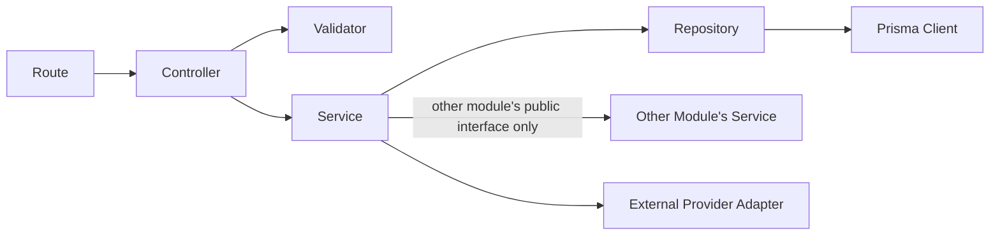

# Backend Architecture & Engineering Standards Document
## ShopSmart AI — Modern Full Stack E-commerce Platform

**Document Version:** 1.0
**Status:** Draft — Official Engineering Handbook
**Source Documents:** PRD, SRS, SDD, DDD, API Design Specification (all v1.0, Approved)
**Last Updated:** July 26, 2026

**Stack:** TypeScript · Node.js · Express.js · PostgreSQL · Prisma ORM · Redis · JWT + Refresh Tokens + HttpOnly Cookies · Zod · Cloudinary · Resend · Pino · Vitest + Supertest · OpenAPI 3.1 · Docker + Nginx + GitHub Actions

---

## 1. Executive Summary

### 1.1 Backend Goals
- Provide a single, consistent architecture that any engineer on the team can extend without guessing at conventions
- Keep business logic testable and decoupled from Express/HTTP and Prisma/database concerns
- Enforce the contracts already fixed by the DDD (Section 13's Repository Pattern) and API Design Specification (Section 6's response envelope) at the code-organization level, not just on paper
- Make the codebase's module boundaries mirror the SDD's domain modules exactly, so architecture diagrams and folder structure never drift apart

### 1.2 Architecture Philosophy
The backend is a **modular monolith** (per SDD Section 5) built with **layered, clean-architecture-influenced** module internals. Each business module is a vertical slice (routes → controllers → services → repositories) rather than the codebase being organized by technical layer at the top level — this keeps related code physically close together and makes module boundaries (and future microservice extraction candidates) obvious just from the folder tree.

### 1.3 Engineering Principles
- **Dependency direction is one-way:** routes depend on controllers, controllers depend on services, services depend on repositories — never the reverse (Section 6)
- **Business logic never touches Express or Prisma directly** — services receive plain data, return plain data or throw typed errors; they don't know they're running inside an HTTP server
- **Every module has one public entry point** — other modules only import a module's `index.ts`/public service interface, never reach into its internals
- **Fail with typed errors, not strings** — every thrown error is an instance of the custom error hierarchy (Section 8), never a raw `Error` or string
- **Validate at the boundary, trust internally** — Zod validates everything entering the system at the controller layer; once past that boundary, inner layers trust the shape of the data

---

## 2. Architecture Style

### 2.1 Layered Architecture (Within Each Module)
Each module follows a strict layering:
```
Route → Controller → Service → Repository → Prisma Client
```
Each layer has one job (Section 5) and calls only the layer directly below it.

### 2.2 Modular Architecture (Across the Codebase)
At the top level, the codebase is organized **by business domain** (`modules/auth`, `modules/products`, `modules/orders`), not by technical type (`controllers/`, `services/` at the root). This is the single most important structural decision in this document — see DDR-BE-004.

### 2.3 Clean Architecture Principles (Applied Pragmatically)
Full Clean Architecture (with framework-agnostic use-case interactors and strict dependency inversion via interfaces everywhere) is **not** adopted wholesale — it's more ceremony than a team of this size needs. Instead, three of its core ideas are kept:
1. **Business logic (services) has no framework dependency** — no `req`/`res` objects reach past the controller layer
2. **Data access is abstracted behind repositories** — services never import `PrismaClient` directly
3. **Dependencies point inward** — infrastructure (Express, Prisma) depends on business logic's interfaces, not the other way around, achieved here via the repository pattern rather than full DI containers

### 2.4 Domain-Driven Module Organization
Module boundaries in code are the exact same boundaries as SDD Section 6 and DDD Section 2 — `modules/orders` owns `Order`, `OrderItem`, `OrderStatusHistory`; `modules/inventory` owns `Inventory`. A service in one module never queries another module's Prisma tables directly — it calls that module's exported service function.

**Why this approach is chosen:** it gives the team ~80% of Clean Architecture's testability and decoupling benefits for a fraction of the boilerplate, keeps the folder structure self-documenting, and — critically — makes the SDD's documented microservice-extraction path (Section 20) a mechanical folder-move rather than a redesign, because module boundaries in code already equal service boundaries.

---

## 3. Folder Structure

```
shopsmart-backend/
├── src/
│   ├── config/                  # Environment & app configuration (Section 11)
│   │   ├── env.ts               # Validated environment variables (Zod-parsed)
│   │   ├── database.ts          # Prisma client instantiation
│   │   ├── redis.ts             # Redis client instantiation
│   │   └── logger.ts            # Pino logger setup
│   │
│   ├── modules/                 # One folder per business domain (Section 4)
│   │   ├── auth/
│   │   │   ├── auth.routes.ts
│   │   │   ├── auth.controller.ts
│   │   │   ├── auth.service.ts
│   │   │   ├── auth.repository.ts
│   │   │   ├── auth.validators.ts   # Zod schemas
│   │   │   ├── auth.dto.ts
│   │   │   ├── auth.types.ts
│   │   │   └── index.ts             # Public interface — the only thing other modules import
│   │   ├── users/
│   │   ├── products/
│   │   ├── categories/
│   │   ├── brands/
│   │   ├── inventory/
│   │   ├── cart/
│   │   ├── wishlist/
│   │   ├── coupons/
│   │   ├── checkout/
│   │   ├── orders/
│   │   ├── payments/
│   │   ├── shipping/
│   │   ├── reviews/
│   │   ├── notifications/
│   │   ├── analytics/
│   │   ├── admin/
│   │   └── cms/
│   │
│   ├── shared/                  # Cross-module, reusable code
│   │   ├── middleware/          # Auth guard, RBAC guard, rate limiter, error handler
│   │   ├── errors/              # Custom error class hierarchy (Section 8)
│   │   ├── utils/               # Pure helper functions (date formatting, money math, slugify)
│   │   ├── constants/           # App-wide constants (enums mirrored from Prisma, default limits)
│   │   ├── types/                # Shared TypeScript types/interfaces (e.g., AuthenticatedRequest)
│   │   ├── events/               # Internal domain event definitions & in-process event bus (Section 14)
│   │   ├── jobs/                 # Background job definitions (Section 14)
│   │   ├── emails/               # Email templates + Resend client wrapper
│   │   └── storage/               # Cloudinary signed-upload helper (Section 13)
│   │
│   ├── routes/
│   │   └── index.ts             # Mounts every module's router under /api/v1
│   │
│   ├── app.ts                   # Express app assembly (middleware chain, route mounting)
│   └── server.ts                # Process entrypoint (starts HTTP server, handles graceful shutdown)
│
├── prisma/
│   └── schema.prisma            # (Owned by Database Design phase — referenced, not redefined here)
│
├── tests/
│   ├── unit/                    # Mirrors src/modules structure
│   ├── integration/             # Supertest-driven API tests
│   └── fixtures/                # Shared test data builders
│
├── logs/                        # Local dev log output (gitignored; production logs ship to stdout)
├── docker/
│   ├── Dockerfile
│   └── nginx.conf
├── .github/workflows/           # CI/CD pipelines (Section 19)
├── openapi/
│   └── openapi.yaml             # The API Design Specification's OpenAPI document, served via Swagger UI
├── .env.example
├── package.json
└── tsconfig.json
```

### Folder Responsibility Reference

| Folder | Responsibility |
|---|---|
| `config/` | Centralizes all environment-dependent setup; nothing outside this folder reads `process.env` directly |
| `modules/<name>/` | One self-contained business domain; owns its routes, controller, service, repository, validators, DTOs, types |
| `shared/middleware/` | Cross-cutting Express middleware used by multiple/all modules |
| `shared/errors/` | The custom error class hierarchy every module throws from |
| `shared/utils/` | Pure, stateless helper functions with no business meaning of their own |
| `shared/constants/` | Enums and fixed values referenced across modules (kept in sync with Prisma enums) |
| `shared/types/` | TypeScript types/interfaces shared across module boundaries (e.g., the authenticated-user shape attached to `req`) |
| `shared/events/` | Domain event type definitions and the in-process publish/subscribe mechanism (Section 14) |
| `shared/jobs/` | Background job handler registrations |
| `shared/emails/` | Email template rendering + Resend client wrapper, consumed by the notifications module |
| `shared/storage/` | Cloudinary signed-upload utility, consumed by any module needing file upload (products, users) |
| `routes/index.ts` | Single place where every module's router is mounted under the versioned `/api/v1` prefix |
| `tests/` | Mirrors `src/` structure 1:1 so any file's tests are easy to locate |

---

## 4. Module Structure

Each module below follows the identical internal shape described in Section 3. This section defines each module's **public interface** (what other modules are allowed to call) and **boundaries** (what it must never do).

| Module | Responsibility | Public Interface (exported from `index.ts`) | Depends On | Boundary Rule |
|---|---|---|---|---|
| **auth** | Registration, login, tokens, sessions | `verifyAccessToken()`, `getCurrentUser()` | users | Never imports from any other module (foundational) |
| **users** | Profile, addresses | `getUserById()`, `getDefaultAddress()` | auth | Owns `User`/`Address` tables exclusively |
| **products** | Catalog, variants, images | `getProductById()`, `isProductPurchasable()` | categories, brands, inventory | Never writes to `Inventory` directly — calls `inventory` module |
| **categories** | Taxonomy | `getCategoryTree()` | — | No dependencies on other modules |
| **brands** | Brand taxonomy | `getBrandById()` | — | No dependencies on other modules |
| **inventory** | Stock tracking | `checkAvailability()`, `reserveStock()`, `decrementStock()`, `restoreStock()` | products (read-only reference) | Sole owner of all stock-mutating logic — no other module writes to `Inventory` |
| **cart** | Cart/cart items | `getCart()`, `clearCart()` | products, inventory | Never creates an `Order` — hands off to `checkout` |
| **wishlist** | Saved products | `getWishlist()` | products | — |
| **coupons** | Discount validation | `validateCoupon()`, `recordRedemption()` | — | Never modifies `Order` or `Cart` directly — returns a discount amount for the caller to apply |
| **checkout** | Orchestrates cart → order | (internal orchestration only; no other module calls into checkout) | cart, coupons, shipping, payments, orders, inventory | The only module allowed to call multiple other modules' write operations within one transaction |
| **orders** | Order lifecycle | `createOrder()`, `getOrderById()`, `updateOrderStatus()`, `cancelOrder()` | inventory, notifications | Sole owner of `Order`/`OrderItem`/`OrderStatusHistory` |
| **payments** | Payment/refund processing | `createPaymentIntent()`, `confirmPayment()`, `issueRefund()` | orders | Sole owner of `Payment`/`Refund`; sole module allowed to call the Stripe adapter |
| **shipping** | Zones, rates, tracking | `calculateShippingCost()`, `resolveZone()` | — | — |
| **reviews** | Product reviews | `submitReview()`, `getProductReviews()` | orders, products | Enforces BR-006 by checking `orders` before allowing a write |
| **notifications** | Email/OTP dispatch | `sendEmail()`, `sendOtp()` | — | Consumed by other modules via events (Section 14), not direct synchronous calls, wherever possible |
| **analytics** | Reporting/aggregation | `getSalesSummary()`, `getTopProducts()` | orders, products, inventory (read-only) | Read-only across all dependencies — never writes to another module's tables |
| **admin** | Staff/RBAC management, dashboard aggregation | `getDashboardSummary()` | all modules (read-scoped per permission) | Aggregates; does not duplicate business logic that belongs in the owning module |
| **cms** | Static pages, banners, FAQ | `getPageBySlug()` | — | — |

**General Rule:** if Module A needs data owned by Module B, Module A imports Module B's public service function — it never imports Module B's repository or Prisma model directly. This is enforced both by convention and, where practical, by an ESLint import-boundary rule (Section 19).

---

## 5. Layer Responsibilities

| Layer | Can Do | Cannot Do |
|---|---|---|
| **Route** | Declare the URL/method/middleware chain; wire to a controller function | Contain any business logic, validation logic, or database access |
| **Controller** | Parse `req`, invoke the validator, call exactly one service method, shape the HTTP response (status code + envelope) | Contain business rules, call the repository/Prisma directly, or call another module's controller |
| **DTO** | Define the shape of data crossing the controller↔service boundary | Contain behavior/methods beyond simple mapping helpers |
| **Validator (Zod)** | Define and enforce request shape/type/format rules | Enforce business rules that require a database lookup (e.g., "does this coupon exist") — those belong in the service |
| **Service** | Implement business rules and orchestration; call one or more repositories within its own module; call other modules' public service functions; throw typed errors | Import Express types (`Request`/`Response`), import `PrismaClient` directly, format HTTP responses |
| **Repository** | Translate service-layer intent into Prisma queries; return plain domain objects/Prisma types | Contain business rules or validation; know anything about HTTP |
| **Database Layer (Prisma)** | Execute queries against PostgreSQL | — |
| **External Providers (Stripe, Cloudinary, Resend)** | Accessed exclusively through a thin adapter in the owning module (`payments/stripe.adapter.ts`, etc.) | Be imported directly by a service outside the owning module |
| **Utilities (`shared/utils`)** | Pure functions with no side effects, no module-specific knowledge | Contain business logic specific to one module |

---

## 6. Dependency Flow



**Allowed dependency direction:** strictly top-to-bottom/left-to-right as drawn above. A lower layer never imports from a higher layer (a repository never imports a controller; a service never imports a route).

**Preventing circular dependencies:**
- A module's `index.ts` is the **only** file another module is allowed to import from — this alone eliminates most accidental circular imports, since internal files (`*.service.ts`, `*.repository.ts`) are never imported cross-module
- If Module A's service needs Module B, and Module B's service would ever need Module A, that is treated as a design smell requiring either (a) extracting the shared concern into a third module, or (b) using the domain-event pattern (Section 14) to decouple the two directions (one calls synchronously, the other reacts to an event) rather than allowing a synchronous cycle
- A lint rule (`eslint-plugin-import` with a `no-restricted-paths` or boundary config, Section 19) flags any import that reaches past a module's `index.ts`

---

## 7. Coding Standards

| Element | Convention | Example |
|---|---|---|
| **Files** | kebab-case, layer-suffixed | `order.service.ts`, `order.repository.ts` |
| **Folders** | kebab-case, singular for shared, matches module domain name | `modules/orders/`, `shared/utils/` |
| **Classes** | PascalCase, suffixed by role where applicable | `NotFoundError`, `StripePaymentAdapter` |
| **Functions/Methods** | camelCase, verb-first | `createOrder()`, `getUserById()` |
| **Variables** | camelCase, descriptive (no single-letter except loop indices) | `orderTotal`, not `ot` |
| **Constants** | SCREAMING_SNAKE_CASE for true constants | `MAX_ORDER_QUANTITY = 10` |
| **Enums** | PascalCase name, matches Prisma enum naming (DDD Section 11) | `OrderStatus.confirmed` |
| **Interfaces/Types** | PascalCase, no `I` prefix (modern TS convention) | `CreateOrderInput`, not `ICreateOrderInput` |
| **DTOs** | Suffixed `Dto` | `CreateOrderDto`, `OrderResponseDto` |
| **Booleans** | Prefixed `is`/`has`/`can` | `isVerified`, `hasStock`, `canCancel` |
| **Comments** | Explain *why*, not *what* (the code already says what); JSDoc on every exported function in a module's public interface | `/** Decrements stock atomically; throws InsufficientStockError if unavailable. */` |
| **Documentation** | Every module's `index.ts` carries a top-of-file comment summarizing the module's responsibility and its public exports, mirroring Section 4's table |

---

## 8. Error Handling Strategy

### 8.1 Custom Error Classes
A small hierarchy, rooted in a base `AppError`, lives in `shared/errors/`:

```
AppError (abstract base — statusCode, code, isOperational)
├── ValidationError        (422)
├── BusinessRuleError      (422)
├── AuthenticationError    (401)
├── AuthorizationError     (403)
├── NotFoundError          (404)
├── ConflictError          (409)
├── PreconditionFailedError (412)
├── RateLimitError         (429)
└── ExternalServiceError   (502)
```

Every module throws these exclusively — never a raw `Error` or string — so the global handler can map them to the API Design Specification's error envelope (Section 7 of that document) mechanically.

### 8.2 Global Error Handler
A single Express error-handling middleware, mounted last in `app.ts`, catches everything and:
1. Logs the error (Section 12) with full context if `isOperational` is false (unexpected) or at `warn` level if `isOperational` is true (expected business error)
2. Maps the error instance's `statusCode`/`code` to the RFC 7807-aligned response shape
3. Never leaks stack traces or internal details to the client in production

### 8.3 Error Categories
| Category | Class | Thrown By |
|---|---|---|
| Validation | `ValidationError` | Zod parse failures at the controller boundary |
| Business | `BusinessRuleError` | Services, when a business rule (BR-xxx) is violated |
| Authentication | `AuthenticationError` | Auth middleware, auth service |
| Authorization | `AuthorizationError` | RBAC guard middleware |
| Infrastructure | `ExternalServiceError` | Adapters wrapping Stripe/Cloudinary/Resend failures |

### 8.4 Logging Policy
- `isOperational = true` errors (expected — bad input, business rule violation) log at `warn`, no alert
- `isOperational = false` errors (unexpected — bugs, infra failures) log at `error`, trigger monitoring alert (SDD Section 15)
- Every log line includes the request's correlation ID (Section 12) so an error can be traced back to the full request context

---

## 9. Validation Strategy

### 9.1 DTO Validation
Every controller defines a Zod schema for its expected request shape (body, query, params) and parses the incoming request through it **before** calling the service. A failed parse throws `ValidationError` with the full list of field-level issues, matching the API spec's `validationErrors` array.

### 9.2 Zod Schemas
Schemas live in each module's `*.validators.ts` file, co-located with the DTOs they validate. Shared primitive schemas (e.g., a reusable `uuidSchema`, `emailSchema`, `moneySchema`) live in `shared/utils/validation-primitives.ts` to avoid duplicating format rules across modules.

### 9.3 Request Validation
Applied uniformly to `body`, `query`, and `params` via a small `validate(schema)` middleware factory used in each module's routes file — validation always happens before the controller function body executes.

### 9.4 Response Validation
For high-value, externally-consumed responses (anything documented in the OpenAPI spec), an optional Zod-based response-shape assertion runs in non-production environments only (dev/test) to catch schema drift between the OpenAPI spec and actual service output early, without adding runtime overhead in production.

### 9.5 File Validation
Handled in `shared/storage/` (Section 13) — MIME type and size checked before a signed Cloudinary upload URL is issued; this is validation logic, not a controller concern, so it lives alongside the upload utility it protects.

---

## 10. Authentication & Authorization

### 10.1 JWT Lifecycle
- Access token: signed, 15-minute expiry, contains `{ sub: userId, role }` only — no PII in the payload
- Verified on every protected request by `shared/middleware/auth.middleware.ts`, which attaches `req.user` for downstream use

### 10.2 Refresh Tokens
Rotation and family-based revocation implemented in the `auth` module exactly per SDD Section 9.2; refresh token hashes (never raw values) are persisted via the `auth` module's repository.

### 10.3 Cookie Strategy
Refresh token cookie is set/cleared exclusively by the `auth` module's controller — no other module ever touches cookies directly.

### 10.4 RBAC
A single `requireRole(...roles)` middleware factory, in `shared/middleware/rbac.middleware.ts`, is applied per-route in each module's routes file, matching the "Roles Allowed" column already defined per-endpoint in the API Design Specification Section 9.

### 10.5 Permission Checks
Ownership checks (e.g., "is this the order's own customer") happen in the **service** layer, not middleware, since they require a database lookup specific to the resource being accessed — RBAC middleware only checks role, not resource ownership.

### 10.6 Middleware Flow


---

## 11. Configuration Management

### 11.1 Environment Variables
All environment variables are declared in a single Zod schema in `config/env.ts` and parsed once at process startup — if any required variable is missing or malformed, the process fails fast at boot rather than failing unpredictably mid-request.

### 11.2 Config Modules
Each infrastructure dependency (`database.ts`, `redis.ts`, `logger.ts`) exports a single configured client instance, imported wherever needed — no module re-instantiates its own Prisma or Redis client.

### 11.3 Secrets Management
No secrets are ever committed to `.env` files in source control (`.env.example` documents required keys with placeholder values only); production secrets are injected via the deployment platform's secrets manager (SDD Section 19).

### 11.4 Environment Separation
`NODE_ENV` (`development` / `staging` / `production` / `test`) gates behavior such as verbose logging, response-shape assertions (Section 9.4), and CORS origin allow-lists.

### 11.5 Feature Flags
A simple boolean-flag table in `PlatformSetting` (DDD Section 5) plus an in-memory cache (Redis-backed, short TTL) allows toggling non-critical features (e.g., a new checkout step) without a deployment; flags are read through a single `isFeatureEnabled(flagName)` utility rather than scattered environment checks.

---

## 12. Logging & Monitoring

### 12.1 Structured Logging
Pino is configured to emit structured JSON logs; every log call includes `module`, `requestId`, and (where relevant) `userId`.

### 12.2 Log Levels
| Level | Usage |
|---|---|
| `trace` | Verbose internal detail, dev-only |
| `debug` | Development diagnostics |
| `info` | Normal operational events (order created, payment confirmed) |
| `warn` | Expected/operational errors (validation failure, business rule violation) |
| `error` | Unexpected failures requiring investigation |
| `fatal` | Process-crashing conditions |

### 12.3 Request IDs / Correlation IDs
A middleware (first in the chain) generates or propagates `X-Correlation-Id` (per API Design Specification Section 5) and attaches it to `req`, Pino's child-logger context, and any OpenTelemetry trace span, so a single ID traces a request end-to-end across logs, metrics, and traces.

### 12.4 Audit Logs
Sensitive admin actions (SEC-010) are logged both to the structured application log **and** written to the `AuditLog` table via the `admin` module's repository — the two are complementary, not redundant: structured logs are for operational debugging, `AuditLog` rows are the permanent, queryable compliance record.

### 12.5 Performance Metrics
Request duration and route-level counters are captured via OpenTelemetry instrumentation (SDD Section 15) at the Express middleware layer, not scattered manually through business logic.

---

## 13. File Upload Architecture

### 13.1 Upload Flow
Exactly per API Design Specification Section 14: the backend issues a signed Cloudinary upload signature (`shared/storage/cloudinary.adapter.ts`); the binary payload never transits through the Express server.

### 13.2 Validation
MIME type/size checks happen in `shared/storage/` before signature issuance, shared across every module that needs uploads (products, users) rather than duplicated per-module.

### 13.3 Image Processing
Resizing/format-optimization is delegated entirely to Cloudinary's transformation URLs — no image-processing library runs on the Node.js server, keeping the backend lightweight and avoiding CPU-bound work on the API process.

### 13.4 Cloudinary Integration
A single adapter class wraps the Cloudinary SDK; it is the only file in the codebase that imports the Cloudinary package directly.

### 13.5 Security
Per SEC-009: strict allow-listed MIME types, size caps, and short-lived (single-use where possible) upload signatures prevent abuse of the upload endpoint.

---

## 14. Background Jobs

### 14.1 Current Approach: In-Process Job Runner
At current scale, non-blocking work (Section 14 of the SDD) is handled by a lightweight in-process job runner (`shared/jobs/`) built on a simple event-emitter + `setImmediate`/async-queue pattern — not a full distributed queue, per SDD ADR-007.

### 14.2 Domain Events
Modules raise typed domain events (`shared/events/`) — e.g., `OrderConfirmed`, `PaymentCaptured`, `StockLow` — rather than calling the `notifications` module synchronously in every case. Listeners (registered at startup) react to these events to send emails, log analytics data, etc., decoupling the triggering module from the reacting one.

### 14.3 Email Queue
The `notifications` module's `sendEmail()` enqueues onto the in-process job runner rather than calling Resend synchronously inline with the triggering request, so a slow email provider never delays the customer-facing response.

### 14.4 Inventory Updates
Bulk stock updates (CSV import) are processed as a background job (`202 Accepted` returned immediately per API Design Specification Section 8), with a job-status endpoint for the client to poll.

### 14.5 Cleanup Tasks
Scheduled jobs (expired `CheckoutSession` purge, expired guest cart cleanup) run on a simple cron-style scheduler (`node-cron` or equivalent) within the same process at MVP scale.

### 14.6 Scheduled Jobs
| Job | Frequency | Purpose |
|---|---|---|
| Expired checkout session cleanup | Every 15 minutes | Release reserved inventory (DDD Section 14.3) |
| Auto-confirm delivery | Daily | Orders past the delivery-confirmation window auto-transition (per business rules established during PRD/Phase 0) |
| Abandoned cart snapshot | Daily | Populates `AbandonedCartSnapshot` for analytics |
| Low-stock digest | Daily | Aggregated admin alert email |

### 14.7 Future Queue Integration
When job volume or reliability requirements outgrow the in-process runner (SDD Section 20), the **domain event contracts defined today become the message schemas** for BullMQ (Redis-backed, simplest upgrade path) or, at larger scale, RabbitMQ/Kafka — the event-driven pattern established now means this upgrade changes the job runner's implementation, not the code that raises/consumes events.

---

## 15. Caching Strategy

### 15.1 Redis Usage
Exactly per SDD Section 11 — Redis serves product/category cache, guest cart, session/rate-limit state, and search-autocomplete data. In code, all Redis access goes through a thin `shared/config/redis.ts` client plus small per-module cache-helper functions (e.g., `products/product.cache.ts`) — no module talks to the raw Redis client without going through a documented key-naming helper.

### 15.2 Cache Keys
Consistent, namespaced key format: `<module>:<entity>:<id>` — e.g., `products:detail:{productId}`, `products:category-tree`, `search:autocomplete:{prefix}`. This convention prevents key collisions across modules and makes bulk invalidation-by-prefix straightforward.

### 15.3 Cache Expiration
| Cache | TTL |
|---|---|
| Product detail | 10 minutes |
| Category tree | 1 hour |
| Search autocomplete | 1 hour |
| Guest cart | 30 days (rolling) |
| Rate-limit counters | Matches the rate-limit window (Section 16 of API spec) |

### 15.4 Cache Invalidation
Write-through, targeted key deletion (SDD Section 11) — e.g., `products.service.ts`'s update method calls `productCache.invalidate(productId)` immediately after a successful Prisma write, within the same service function, so invalidation is never forgotten as a separate step.

### 15.5 Product Cache / Search Cache
Product and search caches are populated lazily (cache-aside pattern): a miss triggers a Prisma query, then a cache write, then the response — never pre-warmed at MVP scale.

---

## 16. Security Standards

| Standard | Implementation Location |
|---|---|
| **Password Hashing** | `auth` module, using bcrypt/argon2 via a small `password.util.ts` — never called directly, always through this wrapper so the hashing algorithm/cost factor is defined in exactly one place |
| **Secure Headers** | Applied globally via a Helmet-equivalent middleware in `app.ts`, mounted before any route |
| **CSRF Protection** | `shared/middleware/csrf.middleware.ts`, applied to cookie-authenticated state-changing routes |
| **XSS Prevention** | Output encoding handled at the API boundary (JSON responses are inherently safe from HTML-injection XSS); any user-generated content (reviews) is sanitized on write in the owning module's service |
| **Injection Prevention** | Enforced structurally — Prisma's parameterized queries are the only DB access path (Section 5); no module is permitted to use `$queryRawUnsafe` without explicit architecture review |
| **Rate Limiting** | `shared/middleware/rate-limit.middleware.ts`, Redis-backed, configured per-route per API Design Specification Section 16 |
| **File Upload Security** | Section 13.5 |
| **Secrets Handling** | Section 11.3 |

---

## 17. Testing Strategy

### 17.1 Unit Testing
Services and pure utility functions are unit-tested in isolation with Vitest, with repositories mocked (via a lightweight fake/in-memory implementation of the repository interface, not a real database) — a service test never touches PostgreSQL.

### 17.2 Integration Testing
Repository-layer tests run against a real (test-environment) PostgreSQL instance via Prisma, verifying actual query behavior, constraints, and transactions.

### 17.3 API Testing
Supertest drives full HTTP-level tests against the Express app (routes through controllers through services through a test database), verifying the actual request/response contract matches the OpenAPI spec — these are the primary tests validating the API Design Specification is honored.

### 17.4 Mocking
External providers (Stripe, Cloudinary, Resend) are always mocked/stubbed in tests below the full end-to-end level — only a small, separate suite of "external smoke tests" (run manually or on a schedule, not on every CI run) hits real sandboxed third-party APIs.

### 17.5 Test Folder Structure
```
tests/
├── unit/
│   └── modules/orders/order.service.test.ts
├── integration/
│   └── modules/orders/order.repository.test.ts
└── api/
    └── orders.api.test.ts
```
Mirrors `src/modules/` exactly so any source file's corresponding tests are found by matching path.

### 17.6 Coverage Goals
| Layer | Target Coverage |
|---|---|
| Services (business logic) | 90%+ |
| Repositories | 80%+ (integration-tested) |
| Controllers | Covered indirectly via API tests, not unit-tested directly |
| Overall project | 80%+ |

---

## 18. Git Workflow

### 18.1 Branch Strategy
`main` (always deployable) ← `develop` (integration branch, optional depending on release cadence) ← `feature/<ticket-id>-short-description`, `fix/<ticket-id>-short-description`, `chore/...`.

### 18.2 Pull Request Rules
- No direct pushes to `main`
- At least one approving review required before merge
- CI (lint, type-check, test) must pass before merge is allowed
- PR description links the relevant module(s) and, where applicable, the FR-xxx/BR-xxx IDs from the SRS being implemented

### 18.3 Code Review Checklist
- Does the change respect the layer boundaries in Section 5?
- Are new errors thrown using the custom error hierarchy (Section 8)?
- Is new input validated with Zod at the controller boundary?
- Are new endpoints reflected in the OpenAPI spec?
- Are cache invalidations added wherever a cached entity is mutated?
- Are tests added at the appropriate layer(s) (Section 17)?

### 18.4 Semantic Commit Messages
Conventional Commits format: `feat(orders): add cancellation endpoint`, `fix(cart): correct stock validation on quantity update`, `chore(deps): bump prisma to 6.x`.

### 18.5 Versioning Strategy
The backend package itself follows Semantic Versioning (`MAJOR.MINOR.PATCH`) independent of the API's own `/api/v1` versioning (API Design Specification Section 4) — a backend patch release can ship internal refactors with zero API contract change.

---

## 19. Code Quality Standards

| Tool | Purpose | Configuration Notes |
|---|---|---|
| **ESLint** | Static analysis, import-boundary enforcement (Section 6) | TypeScript-aware ruleset; custom rule/config restricting cross-module imports to `index.ts` only |
| **Prettier** | Consistent formatting | Runs on save and pre-commit; no manual formatting debates in code review |
| **Husky** | Git hooks | `pre-commit` runs lint-staged; `pre-push` runs the full test suite |
| **lint-staged** | Only lint/format changed files on commit | Keeps commit-time checks fast |
| **Formatting Rules** | Single quotes, trailing commas, 2-space indent, 100-char line width (Prettier defaults, lightly customized) | Enforced by Prettier, not debated per-PR |
| **Static Analysis** | TypeScript strict mode (`strict: true` in `tsconfig.json`) is non-negotiable — no `any` without an explicit inline justification comment | — |

---

## 20. Scalability Guidelines

- **Horizontal Scaling:** every service is written statelessly (no in-process caching of per-request state beyond the request's own lifetime); this is what makes the SDD's horizontal-scaling strategy (Section 17) actually achievable in code, not just on paper
- **Stateless Services:** session-relevant state lives in Redis or the JWT itself, never in application memory (Section 15, Section 10)
- **Microservices Migration:** because each `modules/<name>/` folder already has a single public `index.ts` interface and owns its own tables (Section 4), extracting a module into its own service means moving its folder, replacing its in-process calls to other modules with HTTP/event calls, and standing up its own Prisma connection to its owned tables — a mechanical migration, not a redesign
- **Event-Driven Architecture:** the domain-event pattern (Section 14.2) already used for background jobs is the same pattern that generalizes to a message broker later (SDD Section 20)
- **Read Replicas:** repositories issuing read-only queries (analytics, catalog browsing) are written against a `readClient` Prisma instance from day one (even though it points at the same primary database initially), so routing reads to a replica later is a configuration change in `config/database.ts`, not a code change across every repository
- **Queue Processing:** Section 14.7

---

## 21. Architecture Decision Records (ADRs)

### ADR-BE-001: Express over Fastify/NestJS
**Decision:** Express.js.
**Rationale:** Widest ecosystem/team familiarity, minimal opinionation lets the team's own layered conventions (this document) define structure rather than fighting a more opinionated framework.
**Alternative Considered:** NestJS — rejected as its built-in DI/module system would duplicate the domain-module structure already defined here with additional framework-specific ceremony; Fastify — rejected, marginal performance gain not decisive at this stage.

### ADR-BE-002: TypeScript over JavaScript
**Decision:** TypeScript throughout.
**Rationale:** Compile-time type safety across service/repository/DTO boundaries is essential for a team-scale codebase with this many modules; pairs naturally with Prisma's generated types.

### ADR-BE-003: Prisma over Knex/raw SQL
**Decision:** Prisma ORM (per DDD DDR-002).
**Rationale:** Type-safe query results flowing directly into service-layer TypeScript types eliminates a whole class of shape-mismatch bugs.

### ADR-BE-004: Domain-Module Folder Structure over Technical-Layer Folder Structure
**Decision:** `modules/orders/{routes,controller,service,repository}` rather than top-level `controllers/`, `services/`, `repositories/` folders each containing every module's files.
**Rationale:** Keeps everything related to one business capability physically together, makes module boundaries (and future extraction candidates) visually obvious, and scales far better as module count grows — a technical-layer structure becomes an unnavigable flat folder of 25+ files per layer.
**Alternative Considered:** Technical-layer-first structure — rejected for the scaling reason above; common in smaller codebases but doesn't fit a 25-module platform.

### ADR-BE-005: Repository Pattern
**Decision:** Every module's data access goes through a repository file, not direct Prisma calls in services.
**Rationale:** Keeps services testable without a database (Section 17.1) and gives a single, obvious place to add caching or swap the data layer later.

### ADR-BE-006: Explicit Service Layer (Not Fat Controllers)
**Decision:** Business logic lives in services, never in controllers.
**Rationale:** Controllers are Express-specific and hard to unit test cleanly; keeping them thin (parse → call service → shape response) means the actual business logic is reusable and testable independent of HTTP.

### ADR-BE-007: Zod over Joi/class-validator
**Decision:** Zod for all request validation.
**Rationale:** TypeScript-first — schemas double as compile-time types via `z.infer<>`, eliminating the duplicate-definition problem of maintaining both a validation schema and a separate TypeScript interface.
**Alternative Considered:** class-validator (decorator-based) — rejected as a poorer fit for a non-NestJS, non-class-heavy codebase; Joi — rejected for lacking native TypeScript type inference.

### ADR-BE-008: Redis for Caching (Not In-Memory)
**Decision:** Redis for all caching (per SDD ADR-004), accessed through per-module cache helpers rather than raw client calls scattered through services.
**Rationale:** Survives across multiple stateless instances (Section 20); the helper-function convention keeps key-naming and TTL policy consistent (Section 15).

---

## 22. Risks & Best Practices

| Risk | Best Practice / Mitigation |
|---|---|
| **Module boundary erosion over time** (a developer reaches into another module's internals "just this once") | ESLint import-boundary rule (Section 19) makes this a build failure, not just a code-review nitpick |
| **Business logic leaking into controllers** | Code review checklist (Section 18.3) explicitly checks for this; controllers over ~15 lines are a smell worth flagging |
| **Forgotten cache invalidation** | Convention of invalidating in the same service method that performs the write (Section 15.4), not as a separate, easily-forgotten step |
| **Untyped `any` creeping into the codebase** | TypeScript strict mode + lint rule flagging bare `any` (Section 19) |
| **N+1 queries from careless Prisma relation loading** | Repository methods document their `include`/`select` shape explicitly; code review checks for loops containing awaited DB calls |
| **Silent failures in background jobs** (Section 14) | Every job handler wraps its logic in try/catch, logs failures at `error` level, and — for jobs with business impact (e.g., low-stock digest) — has a dead-letter/retry path even in the in-process runner |
| **Inconsistent error responses across modules** | The custom error hierarchy (Section 8) is enforced by the global handler mapping every error type uniformly — a module literally cannot produce a non-conforming error shape without throwing a raw `Error`, which the handler treats as a `500` and logs loudly for follow-up |
| **Test suite becoming slow/flaky as the module count grows** | Unit tests (fast, isolated, majority of the suite) vs. integration/API tests (slower, minority, run in CI but not on every local save) — coverage goals (Section 17.6) balance thoroughness against speed |

---

## 23. Backend Development Checklist

A phase-by-phase implementation order for developers to follow, building directly on the already-approved DDD and API Design Specification:

**Phase 1 — Foundation**
- [ ] Set up TypeScript, ESLint, Prettier, Husky, lint-staged (Section 19)
- [ ] Implement `config/env.ts` with Zod-validated environment variables
- [ ] Set up Prisma client, Redis client, Pino logger (`config/`)
- [ ] Implement the custom error hierarchy and global error handler (Section 8)
- [ ] Implement correlation-ID middleware (Section 12.3)
- [ ] Implement rate-limiting middleware (Section 16)

**Phase 2 — Identity & Access**
- [ ] Build the `auth` module fully (registration, login, refresh, logout, password reset)
- [ ] Build the auth and RBAC middleware (Section 10)
- [ ] Build the `users` module (profile, addresses)

**Phase 3 — Catalog**
- [ ] Build `categories`, `brands`, `products`, product variants, product images
- [ ] Build the `inventory` module and its optimistic-locking update path (DDD Section 14)
- [ ] Wire product/category Redis caching (Section 15)

**Phase 4 — Shopping Experience**
- [ ] Build `cart`, `wishlist`, `coupons`
- [ ] Build the `checkout` module's orchestration logic
- [ ] Implement the inventory reservation mechanism (DDD Section 14.3)

**Phase 5 — Orders & Payments**
- [ ] Build `orders` (creation, status lifecycle, cancellation, invoice)
- [ ] Build `payments` (Stripe adapter, webhook handler, refunds)
- [ ] Implement the idempotency-key handling pattern (API Design Specification Section 2.4) across checkout/payment/refund endpoints

**Phase 6 — Fulfillment & Post-Purchase**
- [ ] Build `shipping` (zones, rates, tracking)
- [ ] Build `reviews`
- [ ] Build `notifications` and the domain-event/background-job pattern (Section 14)

**Phase 7 — Admin & Operations**
- [ ] Build `admin` (staff/RBAC management, dashboard aggregation)
- [ ] Build `analytics`
- [ ] Build `cms`
- [ ] Build audit logging (Section 12.4)

**Phase 8 — Hardening & Launch Readiness**
- [ ] Achieve coverage goals (Section 17.6) across all modules
- [ ] Complete OpenAPI spec parity check (every implemented endpoint matches the API Design Specification)
- [ ] Load-test the checkout/payment path specifically for concurrency correctness (DDD Section 21 risks)
- [ ] Finalize Docker/Nginx/CI-CD pipeline (SDD Section 19)
- [ ] Security review pass against Section 16 of this document

---

## 24. Final Engineering Summary

The ShopSmart AI backend is a TypeScript/Express modular monolith organized as 17+ domain-first vertical-slice modules, each following an identical internal layering (route → controller → service → repository) with a single enforced public interface per module. Business logic is deliberately isolated from both Express and Prisma, kept testable in isolation, and every module owns its own data exclusively — cross-module data access happens only through explicit, exported service functions, never direct table access.

Engineering discipline is enforced structurally wherever possible rather than left to convention alone: a typed error hierarchy standardizes every failure path into the API's RFC 7807 contract, Zod validates every request at the boundary with types shared directly into the service layer, Redis caching follows a consistent namespaced-key/write-through-invalidation pattern, and ESLint import-boundary rules make module-boundary violations a build failure rather than a review comment. Testing is layered to match the architecture (fast isolated unit tests for services, integration tests for repositories, full API tests for contract verification), and the Git/CI workflow gates every merge on lint, type-check, and test success.

Critically, this structure is not just clean for its own sake — it is the concrete, code-level realization of the SDD's documented evolution path: because module boundaries in code already equal the SDD's proposed microservice boundaries, and because the domain-event pattern used for background jobs today is the same pattern a future message broker would consume, the backend can scale from a single-instance MVP to a horizontally-scaled, eventually-decomposed system without a foundational rewrite. This document is considered complete and ready to serve as the team's official backend engineering handbook for implementation.

---

*End of Document. This Backend Architecture & Engineering Standards Document is ready for development teams to begin implementation.*
